# NutriX-MAS: A Proactive Multi-Agent System for Cognitive Healthcare Informatics

> **Track:** Agentic and Generative AI for Cognitive Healthcare Informatics
> **System:** NutriX — IoT-Integrated, Multi-Agent Dietary Intelligence Platform
> **Version:** 3.0 — Agentic Architecture Specification

---

## Abstract

NutriX is a smart dietary tracking ecosystem comprising an ESP32-S3 IoT scale with an OV2640 camera, a FastAPI microservice backend incorporating YOLOv8 computer vision and local Qwen/LLaMA inference, and a cross-platform Flutter application. This document formalizes the architectural upgrade from a reactive, request-driven pipeline into a **proactive, event-driven Multi-Agent System (MAS)** for precision clinical dietary informatics. The proposed framework introduces four co-operating agent tiers: a Tool-Executing Orchestrator Interface (Tier 1), an Autonomous Outlier Guardian (Tier 2A), a Multi-Agent Clinical MDT (Tier 2B), and an autonomic Meta-Auditor Agent capable of self-healing the inference pipeline without human developer intervention (Tier 3). The architecture explicitly addresses the hallucination risk inherent in generative models by wrapping stochastic LLM inference within deterministic physical solvers (Google OR-Tools LP), ICMR/FDA-grounded nutritional databases, and a formally defined Faithfulness Score ($S_{\text{faith}}$) that drives autonomous system remediation.

---

## 1. Research Formalization

### 1.1 Agent State Machine Definition

To establish academic rigor, every autonomous agent in the NutriX-MAS framework is formally defined as a tuple:

$$\mathcal{A} = \langle \mathcal{S},\ \mathcal{O},\ \mathcal{A}_c,\ \mathcal{T},\ \mathcal{R} \rangle$$

| Symbol | Formal Name | Instantiation in NutriX |
|---|---|---|
| $\mathcal{S}$ | State Space | Live Redis telemetry streams, PostgreSQL persistent records, raw ESP32-S3 sensor frames, and pipeline execution trace logs |
| $\mathcal{O}$ | Observation Function | Weight stabilization events (σ < 0.5g / 500ms), macro-threshold violation triggers from Redis, and inference faithfulness scores from execution traces |
| $\mathcal{A}_c$ | Action Space | REST API endpoint invocations, Google OR-Tools LP solver execution, `retrain_yolo.py` pipeline calls, LLM prompt patch commits, and PostgreSQL record mutations |
| $\mathcal{T}$ | State Transition | $S_{t+1} = \mathcal{T}(S_t, A_t)$ — deterministic for LP solver outputs; stochastic for LLM generation steps |
| $\mathcal{R}$ | Clinical Reward Signal | Minimization of macro-nutrient deviation $\Delta M$ and patient risk score $\rho$ over a 14-day rolling window |

### 1.2 Hybrid Deterministic-Stochastic Decision Engine

A core design principle of this architecture is the deliberate separation of stochastic and deterministic reasoning to mitigate clinical risk from generative AI hallucination:

- **Stochastic Layer:** Natural language comprehension (NL-to-SQL intent parsing), conversational coaching, and clinical rationale generation via local **Qwen2.5-7B-Instruct** or **LLaMA 3.1-8B** served through Ollama/vLLM.
- **Deterministic Layer:** Macro-constraint solving via **Google OR-Tools Linear Programming**, BMR/TDEE computation via the **Mifflin-St Jeor equation**, food identification via **YOLOv8** object detection, and string normalization via **RapidFuzz** (100+ Indian regional synonyms).

No clinical intervention recommendation is delivered without passing through the deterministic layer as a final constraint check.

### 1.3 Faithfulness Score and Self-Healing Trigger

The Tier 3 Meta-Auditor evaluates pipeline output quality using a weighted Faithfulness Score $S_{\text{faith}}$ computed against validated ground-truth databases (ICMR/USDA FoodData Central):

$$S_{\text{faith}} = \frac{\displaystyle\sum_{m \in \mathcal{M}} w_m \cdot \left(1 - \min\!\left(1,\ \frac{|M_{\text{pred}, m} - M_{\text{ground}, m}|}{M_{\text{ground}, m}}\right)\right)}{\displaystyle\sum_{m \in \mathcal{M}} w_m}$$

Where:
- $\mathcal{M} = \{\text{calories, protein, carbohydrates, fat}\}$ — the four macro-nutrient dimensions
- $w_m$ — clinical severity weight per macro (e.g., protein carries higher $w$ for post-surgical patients)
- $M_{\text{pred}}$ — model-generated macro estimate from the LLM Nutrition Service
- $M_{\text{ground}}$ — ground-truth value retrieved from the validated PostgreSQL food library

If $S_{\text{faith}} < \theta_{\text{heal}}$ (threshold configurable, default 0.70), the Meta-Auditor triggers autonomous remediation without human developer intervention.

### 1.4 Privacy and Edge Governance

Protected Health Information (PHI) and biometric data are subject to an **Edge-Filtered Privacy Protocol** enforced at the Flutter client layer. All conversational payloads are stripped of direct identifiers before leaving the local device network. Agent-to-agent communications are routed exclusively over the internal Docker network (no public internet exposure). PostgreSQL records are encrypted at rest; JWT-secured API boundaries prevent cross-user data leakage.

---

## 2. Complete System Architecture

### 2.1 Physical and Network Topology

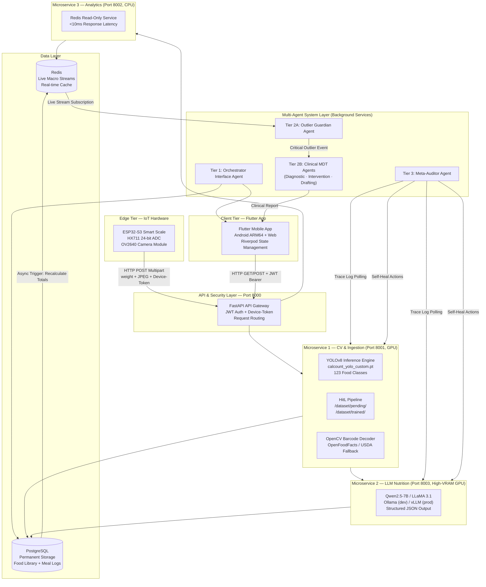

### 2.2 Primary Ingestion Pipeline (Non-Agentic Baseline)

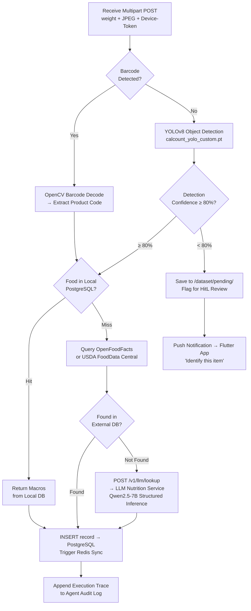

---

## 3. Four-Tier Multi-Agent Architecture

### 3.1 Master Agent Workflow

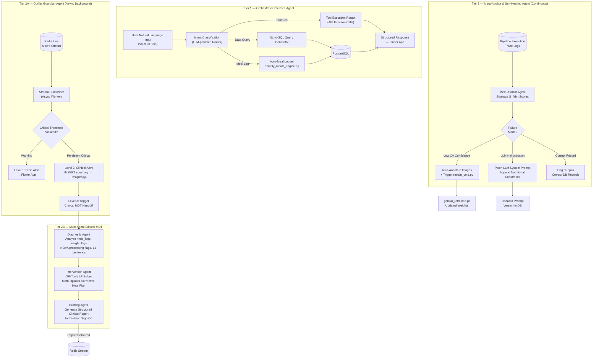

---

## 4. Tier-by-Tier Deep Dive

### 4.1 Tier 1: Orchestrator Interface Agent

**Academic Role:** Tool-Executing Agent Interface — converts unstructured natural language into structured API parameters, positioning this as the agent that bridges the user's cognitive world and the system's computational world.

**Research Pitch:** *"A Tool-Executing Orchestrator Agent for Natural Language-Driven Dietary Database Interaction."*

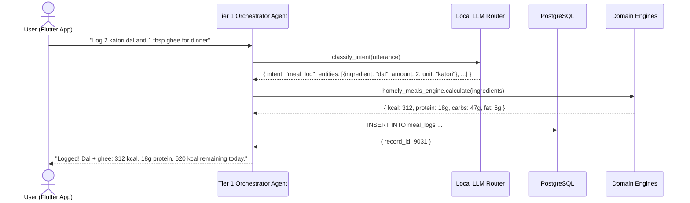

**Tool Registry (Function Calling Interface):**

| Tool Name | Underlying Engine | Trigger Pattern |
|---|---|---|
| `query_macros(food, weight)` | PostgreSQL → food_nutrients | "How many calories in X grams of Y?" |
| `log_meal(ingredients)` | homely_meals_engine.py | "Log [meal] for [meal_type]" |
| `get_daily_summary()` | Redis Analytics Service | "What have I eaten today?" |
| `recommend_recipes(goal)` | recipe_ranker.py | "What should I eat for dinner?" |
| `generate_meal_plan()` | optimization_engine.py (OR-Tools) | "Plan meals for the week" |
| `classify_diet(ingredients)` | classification_engine.py | "Is [product] vegan?" |

**Privacy Enforcement:** Before dispatching to any tool, the Tier 1 agent strips user PII from the canonical utterance. Database queries use parameterized `user_id` references — never raw email or name fields in query payloads.

---

### 4.2 Tier 2A: Autonomous Outlier Guardian Agent

**Academic Role:** Proactive, event-driven patient safety monitor that transforms NutriX from a passive logging tool into an autonomous guardian system.

**Research Pitch:** *"Event-Driven Autonomous Monitoring of Telemetric Dietary Outliers in High-Risk Patients."*

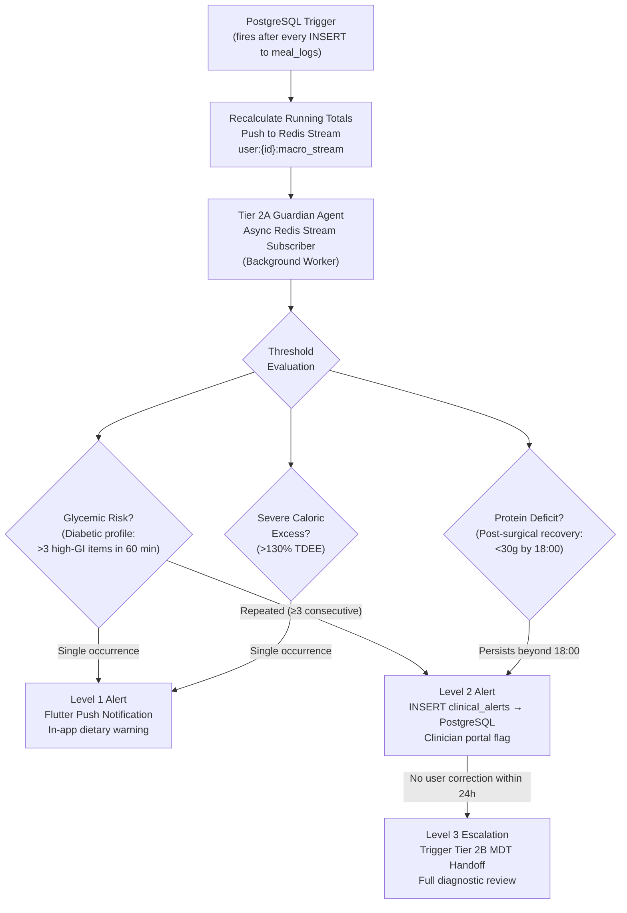

**Clinical Threshold Matrix:**

| Patient Profile | Monitored Signal | Warning Threshold (L1) | Critical Threshold (L2/L3) |
|---|---|---|---|
| Type 2 Diabetic | High-GI food count per 60-min window | ≥ 2 high-GI items | ≥ 3 high-GI items consecutively |
| Post-Surgical Recovery | Cumulative daily protein | < 40g by 18:00 | < 30g by 18:00 |
| Hypertensive | Daily sodium | > 2,000 mg | > 2,300 mg |
| Caloric Restriction | Daily calories vs. TDEE | > 115% | > 130% |
| Protein Goal | Daily protein vs. target | < 70% by 20:00 | < 50% by 20:00 |

**Design Rationale — Why Redis (Not PostgreSQL) for Monitoring:**
Polling PostgreSQL for every threshold check would create an additional 10–50ms read latency per event and couple the guardian's compute load to the primary write path. By subscribing to Redis streams (sub-millisecond reads), the Guardian Agent can evaluate 1,000+ dietary events per second without degrading the primary analytics API path.

---

### 4.3 Tier 2B: Multi-Agent Clinical MDT

**Academic Role:** Distributed cognitive workload across role-specialized sub-agents, mirroring hospital Multidisciplinary Team (MDT) structures where a neurologist, dietitian, and pharmacist each contribute specialized knowledge before a treatment plan is finalized.

**Research Pitch:** *"Multi-Agent Collaborative Reasoning for Precision Clinical Dietary Interventions."*

```mermaid
flowchart TD
    TRIGGER["MDT Trigger\n(from Tier 2A escalation\nor Clinician Manual Request)"]

    subgraph DIAG_BOX["Diagnostic Agent"]
        DIAG1["Load 30-day meal_logs\n(meal type, macros, timestamps)"]
        DIAG2["Scan weight_logs\n(trend analysis via adaptive_planner.py)"]
        DIAG3["Run classification_engine.py\n(NOVA processing levels 1-4\nVegan/Jain/Allergen flags)"]
        DIAG4["Compute Deficit Report\n(Δ macros vs. targets × 30 days)"]
        DIAG1 --> DIAG2 --> DIAG3 --> DIAG4
    end

    subgraph INTERV_BOX["Intervention Agent"]
        INT1["Receive Diagnostic Constraint Vector\n(Δ protein = +25g, Δ sodium = -800mg, ...)"]
        INT2["Invoke OR-Tools LP Solver\n(optimization_engine.py)\nMinimize macro deviation\nSubject to: dietary exclusions, budget, time"]
        INT3["Rank Corrective Recipes\n(recipe_ranker.py)\nBy: health_score × macro_fit × ingredient_coverage"]
        INT4["Output: Mathematically Optimal 4-Slot Plan\n(Breakfast / Lunch / Snack / Dinner)"]
        INT1 --> INT2 --> INT3 --> INT4
    end

    subgraph DRAFT_BOX["Drafting Agent"]
        DR1["Receive Optimal Plan + Diagnostic Summary"]
        DR2["Generate Clinical Report (LLM-drafted)\nSection A: Risk Findings\nSection B: Corrective Protocol\nSection C: Monitoring Targets"]
        DR3["Append Evidence Citations\n(ICMR threshold references\nNOVA processing level definitions)"]
        DR4["Submit for Clinician Sign-Off\nINSERT to clinical_reports table\nFlutter notification to dietitian portal"]
        DR1 --> DR2 --> DR3 --> DR4
    end

    TRIGGER --> DIAG1
    DIAG4 -->|"Constraint Vector"| INT1
    INT4 -->|"Optimal Plan"| DR1
```

**OR-Tools LP Formulation (Intervention Agent Core):**

The optimization problem solved by the Intervention Agent is formally stated as:

$$\text{Minimize} \quad \sum_{m \in \mathcal{M}} w_m \cdot \left| \sum_{r \in \mathcal{R}_{\text{plan}}} x_r \cdot M_{r,m} - T_m \right|$$

Subject to:
- $\sum_{r \in \mathcal{R}} x_r \leq 4$ — at most 4 meal slots per day
- $x_r \in \{0, 1\}$ — binary selection per recipe $r$
- $M_{r,m}$ — macro $m$ per serving of recipe $r$ (from recipe_nutrition table)
- $T_m$ — corrective macro target for dimension $m$ (from Diagnostic Agent)
- Exclusion constraints: $x_r = 0$ if recipe $r$ violates any dietary rule in `ingredient_rules`

---

### 4.4 Tier 3: Meta-Auditor and Self-Healing Agent

**Academic Role:** The meta-level autonomic controller that monitors the system's own inference quality. Operates completely independently of user-facing flows and requires no human developer intervention to execute remediation.

**Research Pitch:** *"A Self-Auditing, Meta-Agentic Pipeline for Automated Quality Assurance in Nutritional Computer Vision."*

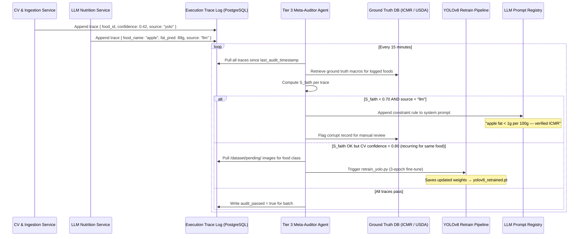

**Faithfulness Score Computation — Detailed Pipeline:**

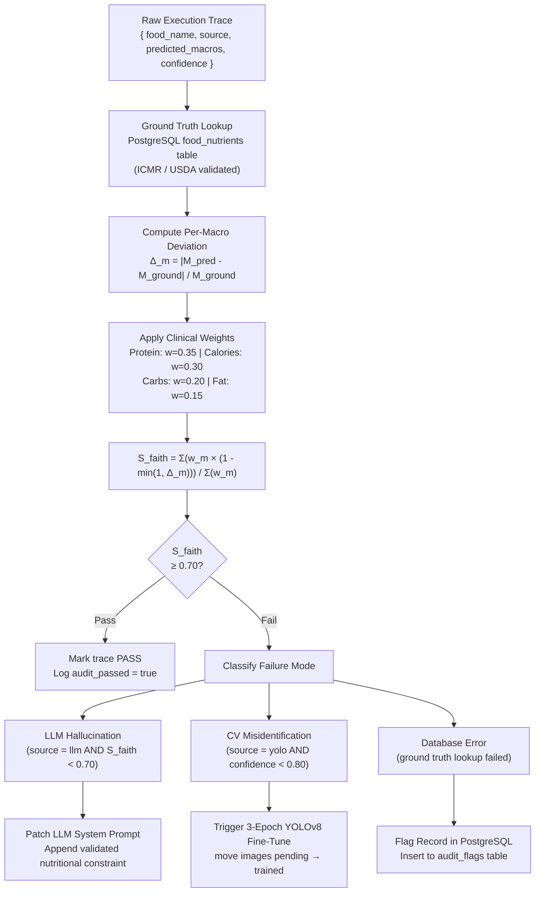

**Self-Healing Action Taxonomy:**

| Failure Mode | Detection Signal | Autonomous Remediation | Escalation Condition |
|---|---|---|---|
| **LLM Hallucination** | $S_{\text{faith}} < 0.70$ AND `source = "llm"` | Append validated constraint to system prompt registry | > 5 consecutive failures for same food class |
| **YOLOv8 Class Drift** | Confidence < 0.80 recurring ≥ 3× for same food class | Move `/dataset/pending/` images → `/dataset/trained/`, trigger `retrain_yolo.py` (3 epochs) | Accuracy < 0.70 post-retrain |
| **Corrupt DB Record** | Ground truth lookup returns NULL or physiologically implausible value (e.g., fat > 100g/100g) | Flag record in `audit_flags` table, remove from live lookup cache | Developer alert via monitoring dashboard |
| **OCR Extraction Error** | Extracted macro sum ≠ 100g ± tolerance | Discard OCR result, fall through to LLM Vision fallback | Gemini Vision API also fails |

---

## 5. End-to-End Agentic Workflow Traces

### Trace A: Autonomous Glycemic Alert → MDT Clinical Report

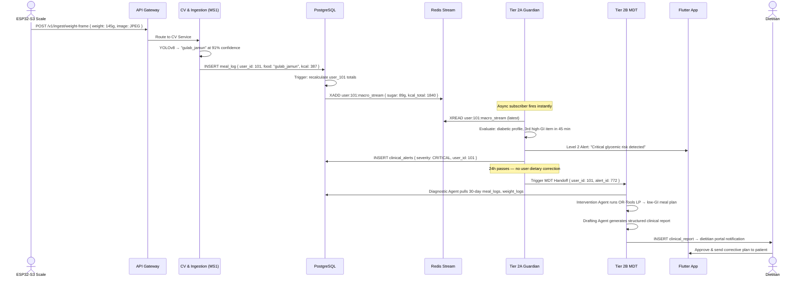

### Trace B: Meta-Auditor Detects LLM Hallucination → Self-Heal

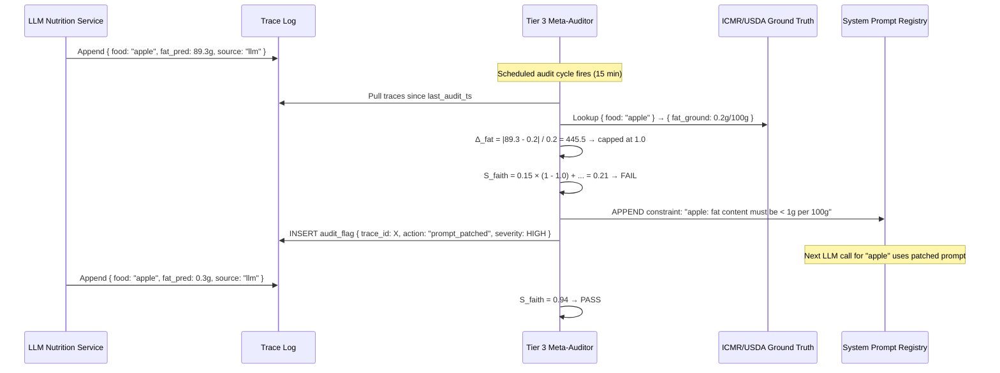

---

## 6. Comparative Analysis: Reactive vs. Proactive Architecture

| Dimension | Reactive NutriX (v2.0) | Proactive NutriX-MAS (v3.0) |
|---|---|---|
| **Patient Safety** | User manually reviews their own data | Guardian Agent detects critical dietary shifts in real time, < 1s latency |
| **Clinical Workflow** | No clinical staff integration | Autonomous MDT report generation with dietitian sign-off portal |
| **Model Quality** | Model degrades silently; requires developer intervention | Meta-Auditor detects drift and self-heals within a 15-minute audit cycle |
| **Hallucination Risk** | LLM output unchecked | Every LLM output evaluated against ICMR/USDA ground truth via $S_{\text{faith}}$ |
| **User Interaction** | Explicit manual logging required | Orchestrator Agent converts natural language to structured DB operations |
| **System Resilience** | Single point of failure per microservice | Autonomous remediation; failing components patched without downtime |
| **Research Contribution** | Applied ML system | Novel MAS with formal agent definitions, event-driven safety protocol, and autonomic self-healing |

---

## 7. Agent Communication and Data Flow Matrix

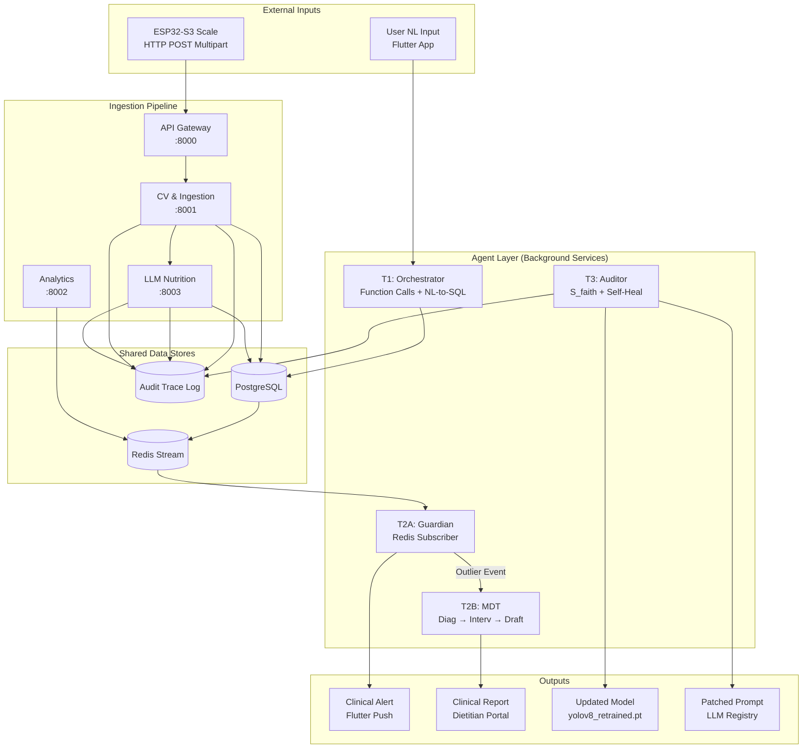

---

## 8. Technology Stack — Agentic Extension

| Component | Technology | Purpose |
|---|---|---|
| **Agent Orchestration** | Python `asyncio` + FastAPI Background Tasks | Non-blocking concurrent agent execution |
| **LLM Inference (Agents)** | Qwen2.5-7B-Instruct via Ollama / vLLM | Intent classification, NL-to-SQL, clinical drafting |
| **Stream Processing** | Redis Streams (`XADD` / `XREAD`) | Sub-millisecond live macro event delivery to Guardian Agent |
| **Constraint Solving** | Google OR-Tools (Linear Programming) | Mathematically optimal corrective meal plan generation |
| **Computer Vision** | Ultralytics YOLOv8 | Food object detection (123 classes, 80% confidence threshold) |
| **Self-Healing Trigger** | `subprocess` → `retrain_yolo.py` | Autonomous 3-epoch fine-tuning on HitL-corrected data |
| **Audit Storage** | PostgreSQL `audit_logs` + `audit_flags` tables | Persistent trace log for faithfulness scoring and failure forensics |
| **Clinical Output** | PostgreSQL `clinical_reports` table | Structured MDT reports with dietitian sign-off workflow |
| **Privacy Layer** | Flutter Secure Storage + JWT | PHI stripping at client edge; parameterized DB queries |
| **Fuzzy NLP** | RapidFuzz (100+ Indian synonym map) | Regional dietary term normalization for NL-to-SQL queries |

---

## 9. Novel Academic Contributions

| Contribution | Description | Research Track Alignment |
|---|---|---|
| **Autonomic Self-Healing Pipeline** | $S_{\text{faith}}$ metric drives zero-human-intervention model remediation | AI-powered hospital resource management; Secure health AI |
| **Event-Driven Guardian Agent** | Redis stream subscription for sub-second dietary anomaly detection | Autonomous patient monitoring systems |
| **Role-Specialized MDT Simulation** | Three sub-agents (Diagnostic, Intervention, Drafting) mirror clinical team structures | Clinical decision-support agents; Digital health twins |
| **Deterministic-Stochastic Hybrid** | OR-Tools LP solver as a hard safety wrapper around stochastic LLM outputs | Trustworthy AI in healthcare |
| **IoT-Native Agent Perception** | ESP32-S3 hardware telemetry directly feeds agent state transitions | Edge AI and connected health infrastructure |
| **NL-Tool-Execution Interface** | Orchestrator converts conversational input to typed API calls without manual form filling | Human-AI interaction for clinical workflows |

---

## 10. Deployment and Containerization

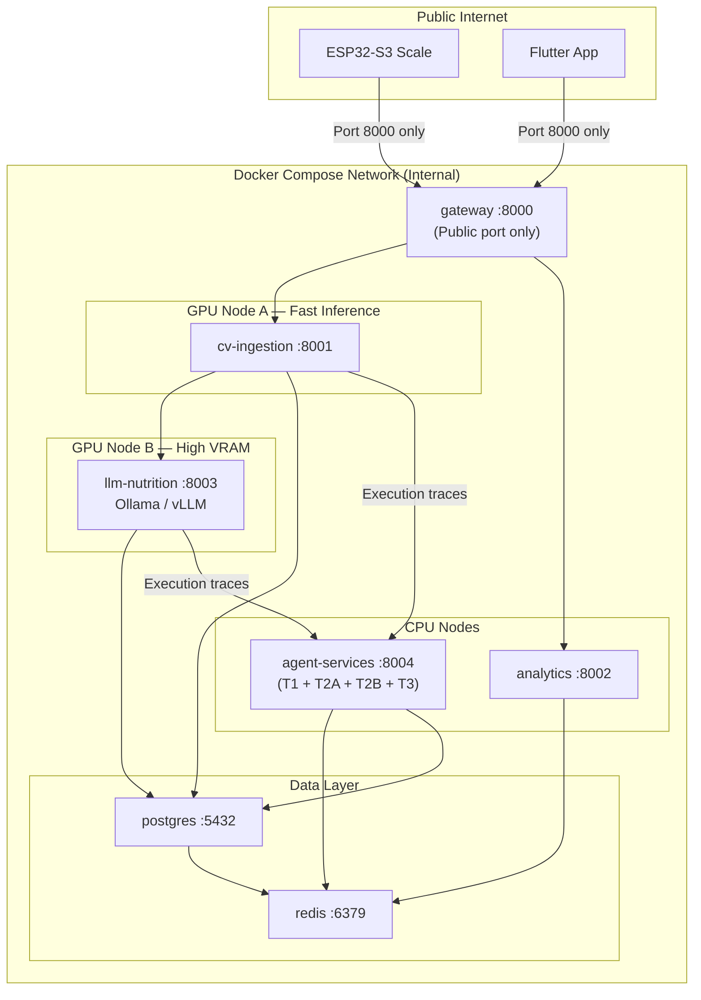

> [!NOTE]
> All four agent tiers run as asynchronous background tasks within a dedicated `agent-services` container. The Guardian Agent (T2A) runs as a persistent `asyncio` event loop. The Meta-Auditor (T3) is scheduled as a recurring task (every 15 minutes). Tiers 1 and 2B are invoked on-demand.

> [!IMPORTANT]
> Only **Port 8000** (API Gateway) is exposed to the public internet. The agent service layer (Port 8004), database ports (5432, 6379), and inference service ports (8001, 8003) are exclusively accessible within the Docker internal network — a critical security boundary for PHI protection.
