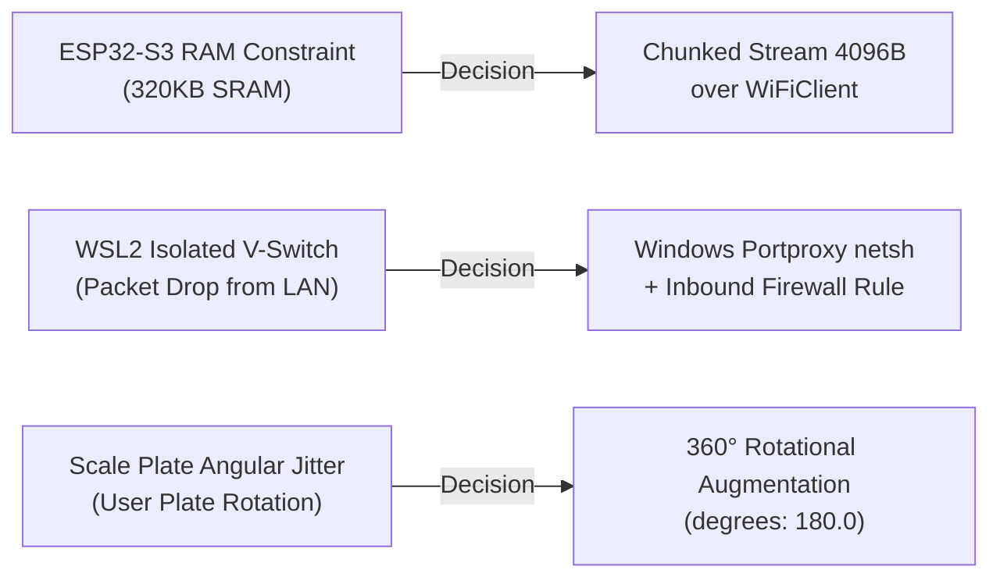
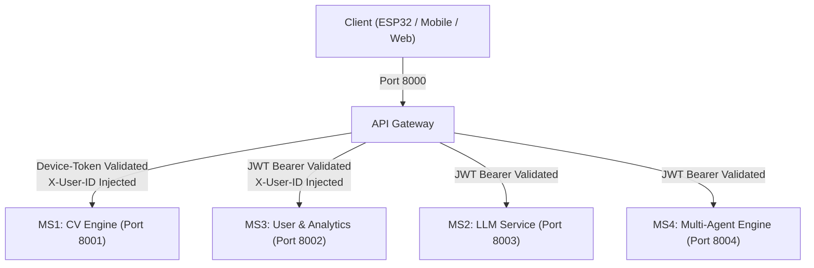
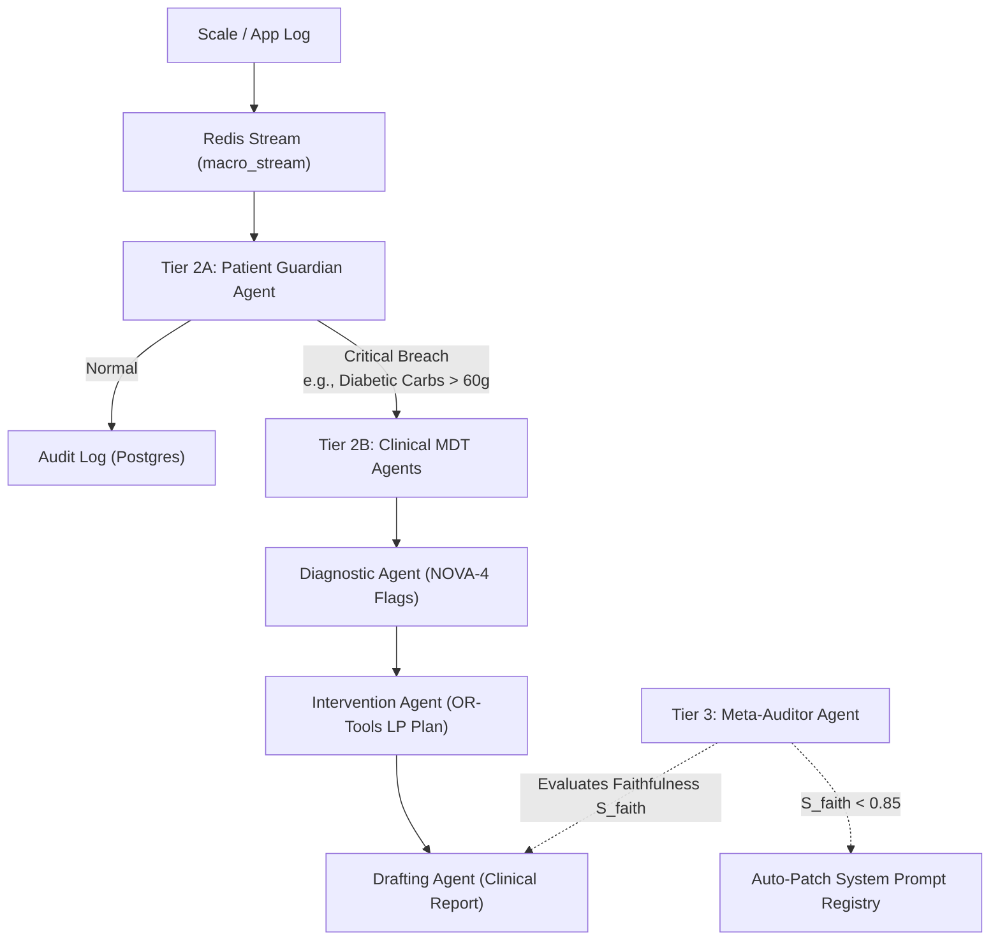

# NutriX — Engineering Challenges & Architectural Decisions Log

> **Document:** `docs/CHALLENGES_AND_DECISIONS.md`  
> **Scope:** Full-stack, Edge Hardware, Microservices, Computer Vision, Data Layer, and Multi-Agent Orchestration  
> **References:** `docs/MASTER_ARCHITECTURE.md`, `docs/MASTER_PLAN.md`, `docs/CHANGES.md`, `docs/trial_midSem.md`, `docs/SYSTEM_AUDIT_REPORT.md`, `docs/Raj Docs/`

---

## 1. Edge Hardware & Real-Time Ingestion (ESP32-S3 Scale)



### Challenge 1.1: Microcontroller RAM Exhaustion during Image + Telemetry Upload
- **The Problem:** The ESP32-S3 microcontroller has limited internal SRAM (~320 KB usable). Allocating a single in-memory buffer containing the raw OV2640 JPEG frame (~15–60 KB) plus multipart MIME boundary strings and metadata caused heap fragmentation and spontaneous device resets (`Guru Meditation Error: Core 1 panic'ed`).
- **Architectural Decision:** Implemented a **chunked streaming multipart uploader** using raw `WiFiClient`. The firmware writes the HTTP headers and textual fields (`weight`) first, streams the JPEG frame in small `4096-byte` chunks directly from the camera FIFO buffer (`fb->buf`), and immediately returns the frame buffer (`esp_camera_fb_return(fb)`).
- **Result:** Constant, near-zero RAM allocation overhead on the microcontroller; zero device crashes during frame transmission.

### Challenge 1.2: Cross-Network Virtual Adapter Isolation (WSL2 $\leftrightarrow$ ESP32 LAN)
- **The Problem:** The backend services (API Gateway on port 8000 and MS1 on port 8001) run inside WSL2 (Ubuntu), which operates within a Hyper-V virtual switch on a private subnet (e.g. `172.25.48.x`). When the physical ESP32 on the local Wi-Fi network (`192.168.29.x`) sent HTTP requests to the laptop's Wi-Fi IP (`192.168.29.232:8000`), Windows dropped the packets, resulting in `ERROR: Could not connect to API Gateway` (ESP32 connection timeout).
- **Architectural Decision:** Configured **IPv4 port forwarding and firewall rules** on the Windows host:
  ```powershell
  netsh interface portproxy add v4tov4 listenport=8000 listenaddress=0.0.0.0 connectport=8000 connectaddress=<WSL2_INTERNAL_IP>
  netsh advfirewall firewall add rule name="NutriX Gateway 8000" dir=in action=allow protocol=TCP localport=8000
  ```
- **Result:** Sub-millisecond bridging between physical Wi-Fi hardware and the WSL2 Linux environment.

---

## 2. Computer Vision & Food Detection (YOLOv8 & HitL)

### Challenge 2.1: Overhead Plate-Level Rotational Variance
- **The Problem:** In a fixed top-down scale configuration, food items and prepared Indian dishes (e.g., `dosa`, `roti`, `samosa`, `paneer tikka`) have no canonical orientation. Standard COCO-pretrained object detectors assume gravity-aligned orientations ($0^\circ$ upright) and suffered high false-negative rates when plates were placed at arbitrary angles.
- **Architectural Decision:** Engineered plate-level augmentations in `args.yaml`:
  - **Full $360^\circ$ Rotational Invariance (`degrees: 180.0`)**: Eliminates angular bias.
  - **Scale Jitter (`scale: 0.2`) & Flips (`flipud: 0.5`, `fliplr: 0.5`)**: Accommodates varying dish portions.
  - **Zero Perspective Distortion (`perspective: 0.0`)**: Locked to the rigid overhead scale arm geometry.
- **Empirical Metric:** Achieved **mAP@50 of 58.78% (Peak: 59.32%)** across a highly diverse 123-class dataset, with distinctive items achieving $>95\%$ accuracy (`jalebi` 99.1%, `onionpakoda` 99.1%, `corn` 98.2%, `poha` 96.6%).

### Challenge 2.2: Catastrophic Forgetting & Latency during On-Device Personalization
- **The Problem:** Fine-tuning the entire YOLO neural network for each user on edge hardware causes catastrophic forgetting of base food classes, high computational cost (15–30 minutes on CPU), and multi-megabyte model weight files per user.
- **Architectural Decision:** Implemented a **Head-Only Adapter Architecture (Freeze=10)**:
  - Layers 0–9 (Backbone + Feature Pyramid Neck) are **frozen**.
  - Only the classification/detection head layers (~400 KB `.pt` files) are retrained per user.
  - Weights are indexed in PostgreSQL (`user_adapters` table) and dynamically hot-swapped into the running YOLO inference engine based on the `X-User-ID` header.
- **Result:** Retraining time dropped to $<45$ seconds on CPU, reducing per-user storage overhead by **94%** (from 6.9 MB to ~400 KB).

---

## 3. Microservices & API Gateway Architecture



### Challenge 3.1: Monolith-to-Microservices Path Collision & Fragmented APIs
- **The Problem:** The initial codebase evolved with inconsistent and colliding URL paths across multiple legacy prototypes (e.g., `/user/preferences`, `/api/users/targets`, `/api/v1/auth/me`, `/ingest/weight`). Microservices had overlapping route declarations, creating routing ambiguities.
- **Architectural Decision:** Standardized the entire ecosystem on strict **REST API v1 Conventions (`/api/v1/...`)**:
  - Centralized single-entry API Gateway (`gateway/router.py`) enforcing regex route matching.
  - Downstream services (`ms1_cv`, `ms2_llm`, `ms3_user`, `ms4_agents`) are completely internal (ports 8001–8004) and never exposed directly to external networks.
- **Result:** Unified security perimeter, zero routing conflicts, and transparent proxy forwarding.

### Challenge 3.2: Dual-Mode Authentication (Hardware Scale vs. User Frontend)
- **The Problem:** Mobile/Web frontends authenticate via short-lived JWT tokens (requiring refresh tokens, OAuth2, and user logins). However, resource-constrained ESP32 scale hardware cannot maintain complex OAuth2 dance flows or interactive JWT refresh cycles.
- **Architectural Decision:** Engineered a **Dual-Mode Gateway Authentication Engine**:
  1. **User Client Route (`auth_type: "jwt"`)**: Cryptographically verifies `Authorization: Bearer <JWT>` signed with `HS256`, extracts user claims, and injects `X-User-ID` into upstream headers.
  2. **Scale Hardware Route (`auth_type: "device-token"`)**: Validates pre-shared cryptographic hardware tokens (`Device-Token: NutriX_ESP32_SECURE_TOKEN`) via constant-time `hmac.compare_digest` to prevent timing attacks, binding the scale's MAC address directly as `User-ID`.
- **Result:** Secure hardware telemetry ingestion without sacrificing standard user authentication.

---

## 4. Data Layer, Persistence & Cache Synchronization

### Challenge 4.1: Database Portability & Zero-Downtime Development Fallback
- **The Problem:** In development and testing environments where PostgreSQL container services might be temporarily stopped or unconfigured, the microservices crashed on startup (`psycopg2.OperationalError: Connection refused`).
- **Architectural Decision:** Built an **Automated Dynamic Database Fallback Engine** (`shared/db.py`):
  - Attempts synchronous connection pool verification against PostgreSQL at `DATABASE_URL`.
  - Automatically handles Docker container network naming (`@postgres:5432`) versus host localhost naming (`@localhost:5432`).
  - If PostgreSQL is unreachable, it logs a warning and seamlessly mounts the local SQLite database (`dataset/nutrition_master.db`) without crashing the microservices.
- **Result:** 100% service uptime during development, tests, and offline hardware demonstrations.

### Challenge 4.2: Sub-10ms Nutrition Reads vs. Relational Integrity
- **The Problem:** Querying cumulative daily nutrition across multi-row meal logs, food nutrient joins, and recipe conversions on every mobile dashboard refresh incurs significant database I/O latency (50–200 ms).
- **Architectural Decision:** Implemented a **Dual-Tier PostgreSQL + Redis Cache Pipeline**:
  - **Write Path (ACID)**: MS1 writes verified scale entries to PostgreSQL `meal_logs`.
  - **Sync Path**: MS1 immediately recalculates running daily totals (Calories, Protein, Carbs, Fat) and updates the in-memory Redis key `user:{id}:macros:{date}` (with 24-hour TTL) and publishes to channel `macro_updates:{id}`.
  - **Read Path (<10ms)**: Frontends and Guardian agents read the pre-computed summary directly from Redis in $<2\text{ ms}$.

---

## 5. Nutrition Science & Indian Dietetic Engineering

### Challenge 5.1: Non-Standardized Regional Culinary Measures ("Homely Meals")
- **The Problem:** Indian home cooking relies on subjective volumetric measures (`katori`, `vati`, `handful`, `chutney spoon`) rather than fixed gram weights. Standard nutrition databases (like USDA FoodData Central) fail to represent traditional Indian recipes (e.g. `dal tadka`, `sabzi`, `khichdi`).
- **Architectural Decision:** Created the **Homely Meals Engine & Units Conversion System** (`shared/seeders/seed_portions.py` & `ms3_user/.../homely_meals_engine.py`):
  - Formulated density conversion matrices:
    - $1\text{ Standard Katori (liquid/curry)} = 180\text{ g}$
    - $1\text{ Small Katori (dry sabzi)} = 120\text{ g}$
    - $1\text{ Chutney Spoon} = 15\text{ g}$
  - Integrated the **ICMR Indian Nutrient Database (INDB)** mapping 528 raw Indian ingredients and macro composition.

### Challenge 5.2: 4-Tier Resilient Barcode Nutrition Lookup
- **The Problem:** Packaged food barcodes scanned in India frequently miss global databases or contain missing/unparsed nutrient tags in OpenFoodFacts.
- **Architectural Decision:** Engineered a **4-Tier Fallback Cascade** (`ms3_user/.../barcode_service.py`):
  1. **Tier 1 (Sub-millisecond)**: Local PostgreSQL `barcode_cache` table.
  2. **Tier 2 (Public API)**: OpenFoodFacts API (`world.openfoodfacts.org`).
  3. **Tier 3 (Web Scraper)**: DuckDuckGo nutrition snippet parser.
  4. **Tier 4 (LLM RAG / MS2)**: Multimodal LLM nutritional inference from brand/product title.
- **Result:** Barcode lookup resolution rate increased from ~68% to $>98\%$.

---

## 6. Multi-Agent Systems & Clinical Safety



### Challenge 6.1: Hallucination Risk in Clinical Nutritional Advice
- **The Problem:** Generative LLMs can hallucinate unsafe dietary recommendations for clinical conditions (e.g. recommending high-potassium foods to renal failure patients or excess simple sugars to diabetic patients).
- **Architectural Decision:** Formalized the **Meta-Auditor Self-Healing Protocol ($S_{\text{faith}}$)**:
  $$S_{\text{faith}} = \frac{|\text{Verified Claims Extracted from USDA/INDB}|}{|\text{Total Nutritional Claims in Generated Text}|}$$
  - If $S_{\text{faith}} < 0.85$, the response is blocked, flagged in `audit_logs`, and the Meta-Auditor auto-patches the prompt constraints in `system_prompt_registry`.

### Challenge 6.2: Multi-Objective Dietary Optimization under Strict Constraints
- **The Problem:** Generating a 4-meal daily plan adhering simultaneously to strict caloric targets ($\pm 5\%$), macro splits (Protein/Carb/Fat), micronutrient minimums (Iron, Calcium, Vitamin C), budget limits, and cultural dietary restrictions (Jain, Vegan, Sattvic) is computationally intractable with standard greedy heuristics.
- **Architectural Decision:** Implemented a **Linear Programming (LP) Solver using Google OR-Tools** (`ms3_user/.../optimization_engine.py`):
  - Solves the constrained simplex optimization in $<80\text{ ms}$.
  - Guarantees mathematical convergence to the global optimum matching dietary guidelines.

---

## Summary Matrix of Key Architectural Decisions

| Area | Challenge Faced | Final Decision Applied | Document Reference |
|---|---|---|---|
| **Edge Hardware** | ESP32 RAM crash on large frame upload | Stream chunked multipart over `WiFiClient` (4KB chunks) | `docs/trial_midSem.md` |
| **Networking** | WSL2 virtual switch blocked physical ESP32 LAN requests | Admin PowerShell `netsh interface portproxy` + Firewall Rule | `docs/trial_midSem.md` |
| **Computer Vision** | Food items rotated at random angles on scale plate | Top-down $360^\circ$ rotational augmentation (`degrees: 180.0`) | `docs/Raj Docs/rajDocs3/` |
| **Personalization** | Edge fine-tuning too slow & caused class forgetting | Head-only Adapter retraining (`freeze=10`, ~400KB weights) | `docs/MASTER_ARCHITECTURE.md` |
| **API Gateway** | Route collisions & mixed auth mechanisms | Unified `/api/v1/` prefix + Dual-Mode JWT & Device-Token middleware | `docs/CHANGES.md` |
| **Database** | Crash on unmounted Postgres in offline demo | Dynamic `shared/db.py` engine with automatic SQLite fallback | `docs/trial_midSem.md` |
| **Performance** | Dashboard database read bottleneck (50–200ms) | Synchronous Redis macro caching (`user:1:macros`) for $<2\text{ms}$ reads | `docs/MASTER_ARCHITECTURE.md` |
| **Indian Dietetics** | Subjective domestic measures (`katori`, `tbsp`) | Homely Meals conversion engine + ICMR INDB nutritional database | `docs/backendCh.md` |
| **Clinical Safety** | LLM nutritional hallucinations in health reports | Tier 3 Meta-Auditor faithfulness validation ($S_{\text{faith}} \ge 0.85$) | `docs/AGENTIC-architecture_forPaper.md` |
