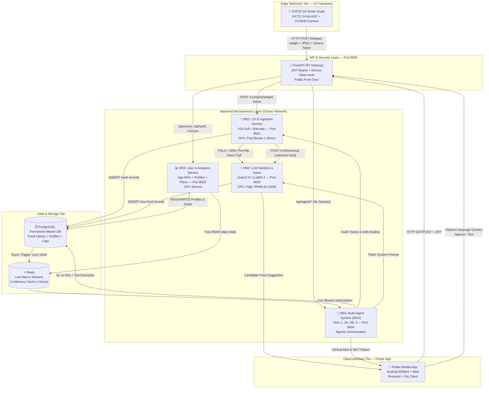
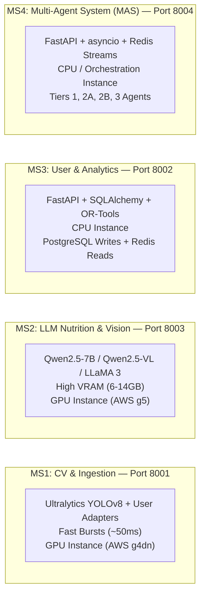
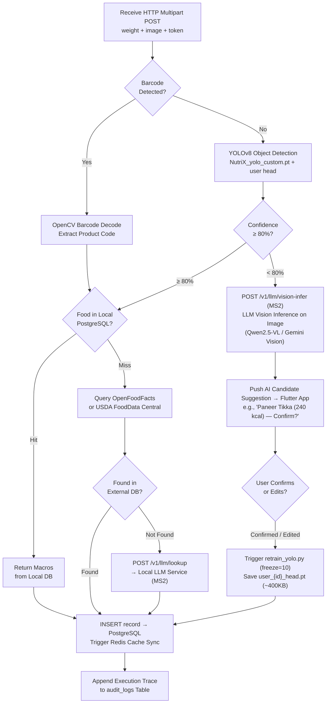
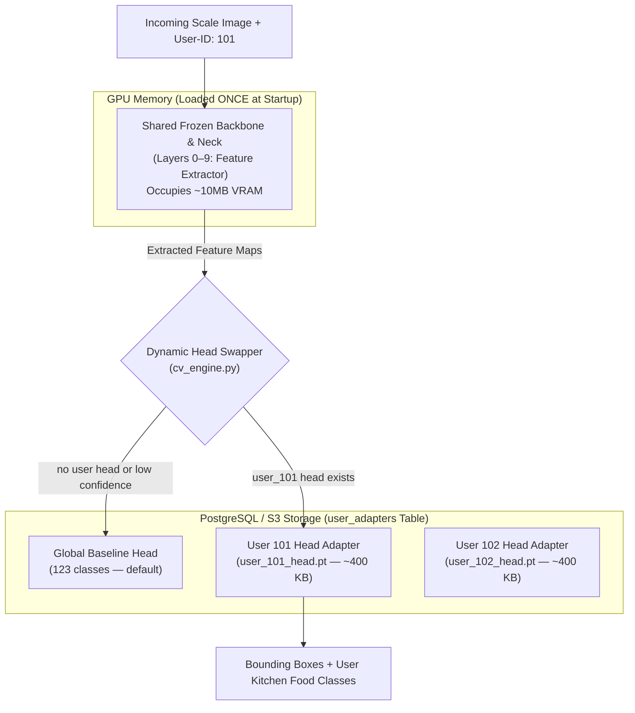
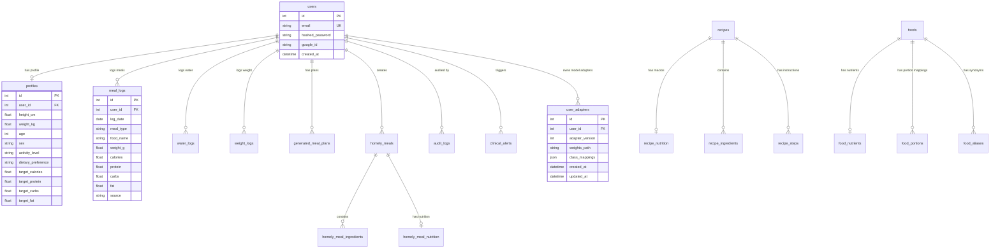
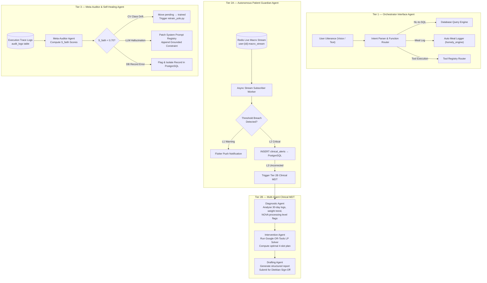
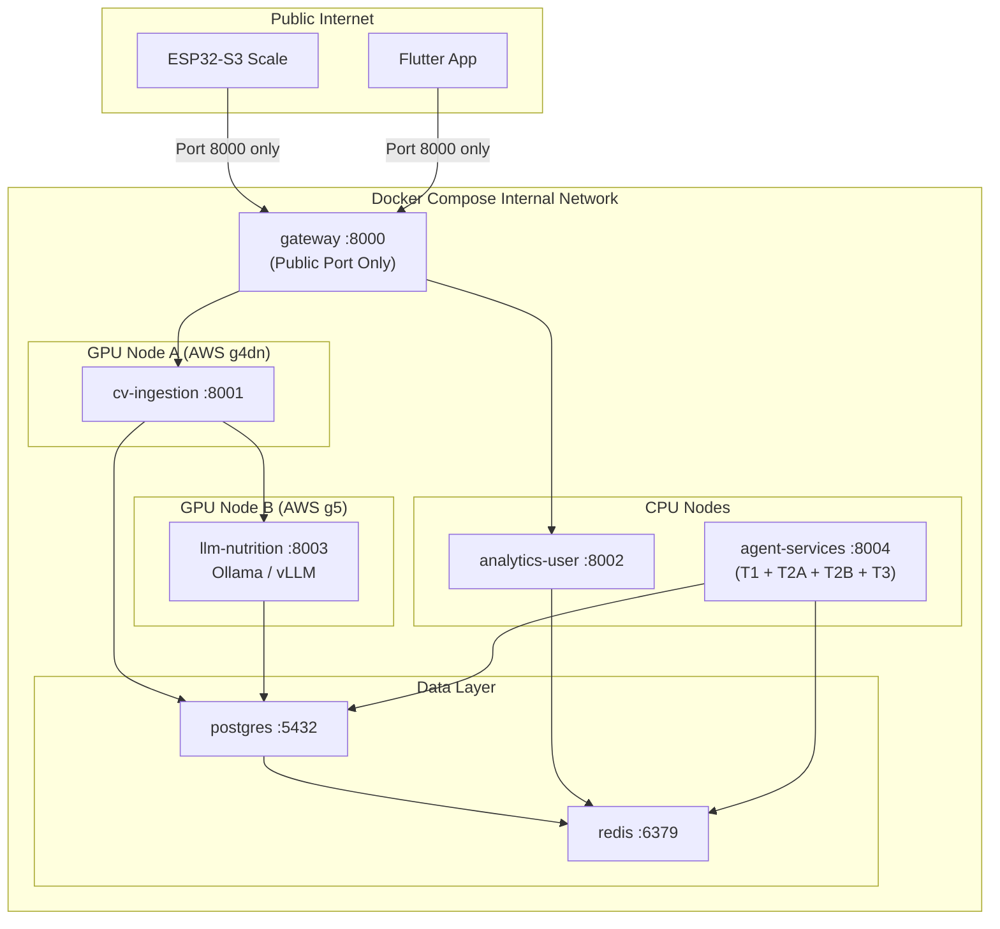
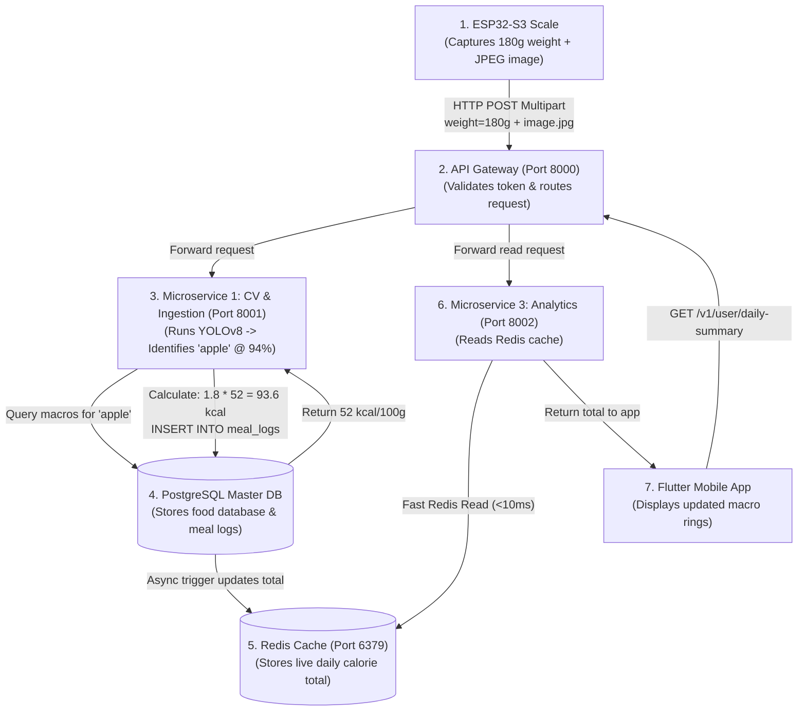

# NutriX — Master System & Agentic Architecture

> **Project:** NutriX Smart Scale AI Food Tracker & Cognitive Healthcare Platform
> **Version:** 3.0 (Master Integrated Specification) | **Last Updated:** August 2026

---

## Executive Summary & System Overview

NutriX is an end-to-end, edge-to-cloud cognitive dietary tracking and clinical informatics ecosystem comprising four integrated microservices and four core tiers:
1. **Edge Telemetry Tier**: An ESP32-S3 physical smart scale equipped with an HX711 24-bit ADC weight sensor and an OV2640 camera module that detects weight stabilization and captures high-resolution food frames automatically.
2. **Cloud Microservices Engine (4 Containers)**:
   - **MS1: CV & Ingestion Service (Port 8001, GPU)**: Handles scale uploads, YOLOv8 object detection (123 classes), and OpenCV barcode decoding.
   - **MS2: LLM Nutrition & Vision Service (Port 8003, GPU)**: Hosts local Qwen2.5/LLaMA models for text-to-nutrition generation AND pre-HitL image vision inference on unidentified items.
   - **MS3: User & Analytics Service (Port 8002, CPU)**: Manages User Auth, Profiles (PostgreSQL writes), Recipe Engine, OR-Tools meal planning, and fast daily dashboard reads (Redis <10ms).
   - **MS4: Multi-Agent System (MAS) Service (Port 8004, CPU/LLM Orchestration)**: Runs all 4 agent tiers (Tier 1 Orchestrator, Tier 2A Outlier Guardian, Tier 2B Clinical MDT, Tier 3 Meta-Auditor).
3. **Multi-Agent System (MAS) Framework**: A 4-tier autonomous agent layer operating over async Redis Streams and PostgreSQL trace logs.
4. **Client Interface Tier**: A cross-platform Flutter application (Android ARM64 + Web) powered by Riverpod state management, Dio HTTP interceptors, Android Keystore JWT security, and biometric re-authentication.



---

## Layer 1 — Edge Telemetry Tier (ESP32-S3 Smart Scale)

**Hardware:** ESP32-S3 (Freenove model) with an OV2640 Camera Module and HX711 24-bit Load Cell ADC.

### 1. Weight Stabilization Algorithm
The scale functions as an intelligent edge telemetry node. It continuously samples the 24-bit HX711 ADC and executes an on-device moving window calculation. It only triggers a capture event when the standard deviation ($\sigma$) of weight readings satisfies:

$$\sigma_{\text{weight}} < 0.5\text{g} \quad \text{sustained continuously for } 500\text{ms}$$

This prevents false capture triggers from hand movements or mechanical settle vibrations.

### 2. HTTP Multipart Form-Data Payload Specification
Once weight stability is confirmed, the ESP32-S3 captures a JPEG image buffer from the OV2640 camera and transmits a single atomic **HTTP POST Multipart Form-Data** request to the API Gateway (`POST /v1/ingest/weight-frame`):

| Payload Field | Data Type | Example Value | Description |
|---|---|---|---|
| `weight` | Text Form Field | `245.3` | Stable weight reading in grams |
| `image` | Binary JPEG | `[raw bytes]` | Captured frame buffer from OV2640 camera |
| `Device-Token` | HTTP Header | `NutriX_ESP32_SECURE_TOKEN_9921` | Hardware authentication token |
| `User-ID` | HTTP Header | `usr_882910` | Unique user identity linked to scale |

**Why Multipart?** Multipart Form-Data allows binary data (the JPEG photo) and textual data (weight float, device token) to be transmitted simultaneously in a single atomic payload, avoiding separate HTTP requests.

---

## Layer 2 — API Gateway Tier (Single Front Door)

**Tech:** FastAPI (Python) | **Port 8000** | Exposed publicly to edge scale and mobile clients.

### Responsibilities
- **Authentication**: Validates `Device-Token` for physical scales and `JWT Bearer Token` for Flutter mobile apps.
- **Request Routing**: Directs heavy vision uploads to MS1 and application/user management endpoints to MS3.
- **Security Boundary**: Isolates internal Docker microservice ports (8001, 8002, 8003, 8004, 5432, 6379) from direct external network exposure.

### Complete Gateway Route Table

| Method | Route | Target Service | Purpose |
|---|---|---|---|
| `POST` | `/v1/ingest/weight-frame` | MS1: CV & Ingestion | Scale telemetry upload (Vision + Weight) |
| `POST` | `/api/auth/register`, `/login`, `/google` | MS3: User & Analytics | User authentication & JWT generation |
| `GET` | `/api/auth/me` | MS3: User & Analytics | Currently authenticated user profile |
| `GET`, `PUT` | `/api/users/{id}` | MS3: User & Analytics | Profile demographics (age, height, weight, goals) |
| `POST` | `/api/users/{id}/preferences` | MS3: User & Analytics | Dietary rules (Vegan, Jain, allergies) |
| `GET` | `/v1/user/daily-summary` | MS3: User & Analytics | Fast Redis read for today's macro progress |
| `GET` | `/v1/user/history` | MS3: User & Analytics | Timestamped meal log history |
| `GET` | `/v1/user/targets` | MS3: User & Analytics | Daily BMR/TDEE target breakdown |
| `POST` | `/api/recipes/recommend` | MS3: User & Analytics | Ingredient-based recipe ranking |
| `POST` | `/api/recipes/generate-instructions` | MS3: User & Analytics | Step-by-step cooking guidance |
| `GET` | `/api/barcode/{barcode}` | MS1: CV & Ingestion | Product lookup via cache / OpenFoodFacts |
| `POST` | `/api/barcode/alternatives` | MS3: User & Analytics | Healthier & cheaper alternative suggestions |
| `POST` | `/api/classify` | MS3: User & Analytics | Ingredient dietary compliance classification |
| `POST` | `/api/ocr/upload` | MS1: CV & Ingestion | Nutrition label text extraction |
| `POST` | `/api/meal-logs` | MS3: User & Analytics | Manual meal entry logging |
| `POST` | `/api/meal-plans/generate` | MS3: User & Analytics | Google OR-Tools 4-slot meal plan solver |
| `POST` | `/api/ai/coach` | MS3: User & Analytics | Conversational diet coaching |
| `POST` | `/api/agent/query` | MS4: Multi-Agent System | Natural Language intent parsing & tool execution (Tier 1) |
| `POST` | `/v1/llm/lookup` | MS2: LLM Nutrition & Vision | Internal text-to-nutrition generation for unknown foods |
| `POST` | `/v1/llm/vision-infer` | MS2: LLM Nutrition & Vision | Internal image vision inference for pre-HitL food suggestions |

---

## Layer 3 — Backend Microservices Architecture

### Service Separation & Hardware Allocations



---

### Microservice 1: CV & Ingestion Service

**Tech:** FastAPI + Ultralytics YOLOv8 + OpenCV + Python | **Port 8001** | **GPU required**

#### Ingestion & Computer Vision Execution Pipeline



#### Lookup Priority Order
1. **Local PostgreSQL**: Sub-millisecond lookup for cached/previously identified foods.
2. **OpenFoodFacts / USDA FoodData Central**: Free public barcode and food composition lookup APIs.
3. **Local LLM Nutrition Service (MS2)**: Last resort for completely novel food items (self-hosted, zero per-call API cost).

#### Per-User YOLOv8 Adapter Architecture (`cv_engine.py`)

To scale custom kitchen food recognition to thousands of users without VRAM exhaustion or storing gigabytes of duplicate model files, NutriX uses a **Shared Frozen Backbone + Per-User Adapter Head** architecture:



1. **Shared Feature Extractor (Backbone & Neck)**:
   - YOLOv8 Layers 0 through 9 (Backbone & Neck) extract multi-scale visual features (edges, textures, shapes).
   - Loaded into GPU memory **once** at server startup (~10 MB VRAM total). Shared across all incoming requests.

2. **Per-User Detection Head Adapters (~400 KB)**:
   - Baseline Model: `NutriX_yolo_custom.pt` (Global 123-class model).
   - User Adapter: `user_{user_id}_head.pt` (~400 KB) containing fine-tuned weights for user-specific kitchen items and regional dishes.
   - Stored in S3/PostgreSQL `user_adapters` table with class mappings.

3. **Dynamic Head Swapping at Inference**:
   - `cv_engine.py` inspects the incoming `User-ID` header.
   - If a user adapter exists in cache/DB, it dynamically attaches `user_{user_id}_head.pt` to the shared feature extractor.
   - If confidence is low or no adapter exists, it falls back to the Global 123-Class Baseline Head.

#### Pre-HitL LLM Vision Fallback & Adapter Retraining (`hitl_engine.py` & `retrain_yolo.py`)
When a scale frame fails auto-confirmation (<80% confidence):
1. **Pre-HitL Vision Inference**: MS1 passes the image to MS2 (`POST /v1/llm/vision-infer`) running Qwen2.5-VL / Gemini Vision API to infer the food identity and estimate initial macros.
2. **One-Tap User Confirmation**: The Flutter app presents an AI candidate suggestion (*"We think this is Paneer Tikka (240 kcal) — Confirm or Edit?"*), reducing user friction to a single tap.
3. **Annotation Generation**: Upon user confirmation/editing, `hitl_engine.py` auto-generates the bounding box annotation (`.txt`) and saves the image to `/dataset/trained/user_{user_id}/`.
4. **Adapter Retraining**: `retrain_yolo.py` executes with **`freeze=10`** (freezing Backbone & Neck, updating ONLY the final head layer in 2–5 seconds).
5. **Output**: Only the lightweight head weights (`user_{user_id}_head.pt`, ~400 KB) are saved to PostgreSQL `user_adapters`. Baseline model weights remain untouched.

---

### Microservice 2: LLM Nutrition & Vision Service

**Tech:** FastAPI + Ollama (dev) / vLLM (prod) serving **Qwen2.5-7B-Instruct** / **Qwen2.5-VL** or **LLaMA 3.1** | **Port 8003** | **GPU + High VRAM required**

Provides dual LLM intelligence capabilities: 1) Text-based structured nutritional composition lookup for unknown foods, and 2) Multimodal Vision inference for pre-HitL scale frame candidate identification.

#### Dual Capabilities

| Endpoint | Input Payload | Output Format | Purpose |
|---|---|---|---|
| `POST /v1/llm/lookup` | `{ "food_name": "murgh makhani" }` | Structured JSON (`calories_per_100g`, `protein_g`, `carbs_g`, `fat_g`) | Text-to-nutrition generation for unknown foods |
| `POST /v1/llm/vision-infer` | JPEG Frame Buffer + Weight | Candidate Food Name + Initial Macro Estimates | Pre-HitL candidate food suggestion when YOLO confidence < 80% |

#### Prompt Engineering Specification
The LLM is invoked as a deterministic structured JSON generator, not a conversational chatbot:

```text
You are a nutrition database engine. Given a food name, return ONLY a valid JSON object 
with keys: calories_per_100g, protein_g, carbs_g, fat_g.
Do NOT include markdown, explanations, or conversational filler.
Food: murgh makhani
```

Expected JSON Output:
```json
{
  "food_name": "murgh makhani",
  "calories_per_100g": 150.0,
  "protein_g": 11.2,
  "carbs_g": 8.4,
  "fat_g": 8.1,
  "source": "local-llm"
}
```

#### Timeout & Resilience Protocol
- MS1 enforces a **10-second request timeout** on calls to MS2.
- If MS2 times out or fails, MS1 assigns a placeholder macro record marked `source: "llm-timeout"`, logs an execution trace, and queues the request for offline retry.

---

### Microservice 3: User Management & Analytics Service

**Tech:** FastAPI + Python + SQLAlchemy ORM + Google OR-Tools + Redis | **Port 8002** | **CPU Service**

Manages application logic, user profiles, authentication, diet plan optimization, and analytics dashboards.

#### Core Endpoint & Storage Operations

| Endpoint Category | Endpoint | Storage Operation | Description |
|---|---|---|---|
| **User Profile** | `PUT /api/users/{id}` | PostgreSQL **WRITE** | Updates height, weight, age, activity level, fitness goal |
| **Preferences** | `POST /api/users/{id}/preferences` | PostgreSQL **WRITE** | Sets dietary exclusions (Vegan, Jain, Gluten-Free, Allergies) |
| **Auth** | `POST /api/auth/register`, `/login` | PostgreSQL **WRITE** | User credential registration & Bcrypt password hashing |
| **Analytics** | `GET /v1/user/daily-summary` | Redis **READ** (<10ms) | Live daily calories + protein/carbs/fat rings vs target |
| **Meal Log History**| `GET /v1/user/history` | PostgreSQL / Redis | Chronological meal diary log |
| **Meal Optimization**| `POST /api/meal-plans/generate` | PostgreSQL **READ** | Executes Google OR-Tools LP solver for 4-slot daily plan |
| **Homely Builder** | `POST /api/homely/calculate` | PostgreSQL **READ** | Household unit to gram conversion (`katori`, `tbsp` → grams) |

---

## Layer 4 — Data & Storage Tier (PostgreSQL + Redis Hybrid)

### Dual-Database Architecture

| Database | Primary Role | Data Stored | Access Latency |
|---|---|---|---|
| **PostgreSQL** | Permanent Relational Truth | User accounts, profiles, food master library, meal logs, recipe DB, audit trace logs | 10–50 ms |
| **Redis** | In-Memory Live Cache & Event Streams | Daily running calorie/macro totals, live telemetry streams (`user:{id}:macro_stream`) | < 0.1 ms |

### Real-Time Synchronization Loop

```text
1. Ingestion Service (MS1) writes new meal log → PostgreSQL
         ↓
2. PostgreSQL trigger recalculates user's cumulative daily totals
         ↓
3. Redis key updated instantly → user:101:daily_calories = 1420
         ↓
4. Analytics Service (MS3) reads Redis → sends payload to Flutter app
         ↓
5. Flutter app macro progress rings update live (<10ms total UI latency)
```

### Complete Entity-Relationship (ER) Diagram



---

## Layer 5 — Multi-Agent System (MAS) Framework

### 1. Mathematical Agent Formalization
Each autonomous agent in the NutriX-MAS framework is formally defined as a 5-tuple:

$$\mathcal{A} = \langle \mathcal{S},\ \mathcal{O},\ \mathcal{A}_c,\ \mathcal{T},\ \mathcal{R} \rangle$$

- **$\mathcal{S}$ (State Space):** Redis live telemetry streams, PostgreSQL persistent tables, raw scale frames, and execution audit trace logs.
- **$\mathcal{O}$ (Observation Function):** Detection of weight stabilization, macro-nutrient threshold breaches, and inference faithfulness score evaluations.
- **$\mathcal{A}_c$ (Action Space):** REST endpoint execution, OR-Tools solver execution, `retrain_yolo.py` invocation, LLM system prompt updates, and PostgreSQL audit mutations.
- **$\mathcal{T}$ (State Transition):** $S_{t+1} = \mathcal{T}(S_t, A_t)$ — deterministic for LP solvers; stochastic for LLM generation steps.
- **$\mathcal{R}$ (Clinical Reward Signal):** Minimization of daily macro deviation $\Delta M$ and patient risk scores over a 14-day rolling window.

### 2. Hybrid Deterministic-Stochastic Decision Engine
- **Stochastic Layer:** Natural language intent classification, conversational coaching, and clinical narrative generation via local Qwen2.5/LLaMA.
- **Deterministic Layer:** Macro constraint optimization via **Google OR-Tools LP**, BMR/TDEE calculation via the **Mifflin-St Jeor equation**, object detection via **YOLOv8**, and string normalization via **RapidFuzz**.

---

### 3. Four-Tier Agent Architecture



---

### 4. Tier Deep Dives

#### Tier 1: Orchestrator Interface Agent
Positioned as a Tool-Executing Agent Interface converting unstructured user inputs into typed API calls:

| Tool Function | Core Engine Module | Example User Utterance |
|---|---|---|
| `query_macros(food, weight)` | `nutrition_engine.py` | "How many calories in 200g of paneer?" |
| `log_meal(ingredients)` | `homely_meals_engine.py` | "Log 2 katori dal and 1 tbsp ghee for dinner" |
| `get_daily_summary()` | Redis Analytics Service | "How much protein do I have left today?" |
| `recommend_recipes(goal)` | `recipe_ranker.py` | "Suggest a high-protein vegetarian dinner" |
| `generate_meal_plan()` | `optimization_engine.py` | "Build a 2000 kcal meal plan for tomorrow" |

#### Tier 2A: Autonomous Patient Guardian Agent
Operates as an async background subscriber tapping directly into Redis live macro streams:

| Patient Profile | Monitored Metric | L1 Warning Threshold | L2/L3 Critical Escalation |
|---|---|---|---|
| **Type 2 Diabetic** | High-GI item count / 60 min | ≥ 2 high-GI items | ≥ 3 high-GI items consecutively |
| **Post-Surgical Recovery** | Cumulative daily protein | < 40g by 18:00 | < 30g by 18:00 |
| **Hypertensive** | Cumulative daily sodium | > 2,000 mg | > 2,300 mg |
| **Caloric Restriction** | Daily calories vs TDEE | > 115% TDEE | > 130% TDEE |

#### Tier 2B: Multi-Agent Clinical MDT
Coordinates three specialized sub-agents:
1. **Diagnostic Agent**: Scans 30-day `meal_logs`, weight trends (`adaptive_planner.py`), and ingredient NOVA processing flags (`classification_engine.py`). Outputs a deficit constraint vector.
2. **Intervention Agent**: Takes the deficit vector and solves the Google OR-Tools Linear Programming problem:

$$\text{Minimize} \quad \sum_{m \in \mathcal{M}} w_m \cdot \left| \sum_{r \in \mathcal{R}_{\text{plan}}} x_r \cdot M_{r,m} - T_m \right|$$

3. **Drafting Agent**: Formats the solver output into a structured clinical report containing diagnostic findings, corrective meal schedules, and ICMR evidence citations for dietitian sign-off.

#### Tier 3: Meta-Auditor & Autonomic Self-Healing Agent
Computes the quantitative Faithfulness Score ($S_{\text{faith}}$) comparing predicted macros against ground-truth databases (ICMR / USDA FoodData Central):

$$S_{\text{faith}} = \frac{\displaystyle\sum_{m \in \mathcal{M}} w_m \cdot \left(1 - \min\!\left(1,\ \frac{|M_{\text{pred}, m} - M_{\text{ground}, m}|}{M_{\text{ground}, m}}\right)\right)}{\displaystyle\sum_{m \in \mathcal{M}} w_m}$$

Where $w_{\text{protein}} = 0.35$, $w_{\text{calories}} = 0.30$, $w_{\text{carbs}} = 0.20$, $w_{\text{fat}} = 0.15$.

**Self-Healing Taxonomy:**
- If $S_{\text{faith}} < 0.70$ and `source = "llm"` $\rightarrow$ Patches the System Prompt Registry with validated numerical boundary constraints.
- If CV confidence < 0.80 repeatedly for a food $\rightarrow$ Moves pending frames to `/dataset/trained/` and executes `retrain_yolo.py` (3-epoch fine-tuning).

---

## Layer 6 — Client Interface Tier (Flutter Mobile App)

**Tech:** Flutter 3.x (Dart) | Android ARM64 + Web | **State Management:** Riverpod 2.6 | **HTTP:** Dio 5.7

### Architecture & Security Model
- **Network Layer**: All HTTP calls flow through a central `ApiClient` with Dio interceptors automatically attaching `Authorization: Bearer <JWT_TOKEN>`.
- **JWT Storage**: Session tokens are stored securely in Android Keystore via `flutter_secure_storage`.
- **Biometric Locking**: `WidgetsBindingObserver` monitors app lifecycle events (`AppLifecycleState.resumed`) and enforces Fingerprint/Face ID unlock via `local_auth`. An `ignoreNextLifecycleResume` flag prevents false locking when launching the native camera or image picker.

### Primary App Screens
1. **Home Dashboard (`home_screen.dart`)**: Animated macro progress rings (`percent_indicator`), 7-day calorie chart (`fl_chart`), and real-time meal diary list.
2. **Kitchen & Recipe Discovery (`recipe_search_screen.dart`)**: Pantry ingredient search, diet filters, ranked recipe cards, and AI step-by-step cooking guides.
3. **Barcode & Scan Center (`barcode_scanner_screen.dart`)**: Native camera barcode scanner (`simple_barcode_scanner`), dietary classifier, and EasyOCR nutrition label scanner.
4. **Homely Builder (`homely_builder_screen.dart`)**: Real-time home cooking portion calculator (converts `katori`, `tbsp` to grams and accounts for oil absorption).
5. **AI Coach (`ai_coach_screen.dart`)**: Conversational diet guidance powered by RAG-enhanced local LLM context.

---

## Datasets & Knowledge Base Inventory

### 1. Nutrition & Recipe Knowledge Base
- **`INDB.xlsx` (1.0 MB)**: ICMR Indian Nutrient Database containing regional raw food composition values.
- **`recipes.xlsx` (714 KB)**: Master recipe database with per-serving calorie and macro breakdowns.
- **`Indian_Food_DF.csv` (174 KB) & `Indian_Food_Nutrition_Processed.csv` (88 KB)**: Recipe ingredient mapping and processed nutrients.
- **`Units.xlsx` (28 KB)**: Portion unit to gram conversion lookup tables (`1 katori = 180g`, `1 tbsp = 14g`).
- **USDA FoodData Central**: Foundation CSV datasets (`food.csv`, `food_nutrient.csv`, `food_portion.csv`).
- **International Tables**: UK and US Food Composition Tables (`UK_fct.xlsx`, `US_fct.xlsx`).
- **RecipeNLG Dataset (2.3 GB, local-only)**: 2.2 million recipes with NER tagging for query parsing.

### 2. Computer Vision & YOLO Image Datasets
The custom YOLOv8 detector is trained on a consolidated 123-class dataset:
- **`combined-vegetables-fruits` (Roboflow `yolo-jpkho`)**: Raw fruit and vegetable bounding box geometries.
- **`food-ingredients-dataset` (Roboflow `food-recipe-ingredient-images-0gnku`)**: Cooking component image dataset.
- **`indianfoodnet` (Roboflow `indianfoodnet`)**: Prepared Indian dish image dataset.
- **`dataset/pending/`**: Scale frames flagged for low confidence (<80%).
- **`dataset/trained/`**: User-verified images and generated `.txt` bounding box annotations ready for retraining.

---

## Docker Container Architecture & Cloud Deployment



### Dev vs. Production Cloud Mapping

| Local Dev Component | AWS Production Target | GCP Production Target |
|---|---|---|
| **API Gateway (:8000)** | Application Load Balancer + ECS Task | Cloud Run Service |
| **CV Service (:8001)** | ECS Task on GPU instance (`g4dn.xlarge`) | Cloud Run GPU Service |
| **LLM Service (:8003)** | ECS Task on GPU instance (`g5.xlarge`) | Cloud Run GPU (24GB VRAM) |
| **User Service (:8002)** | ECS Task on CPU instance (`t3.medium`) | Cloud Run CPU Service |
| **Agent Services (:8004)**| ECS Task on CPU instance | Cloud Run CPU Service |
| **PostgreSQL (:5432)** | Amazon RDS (PostgreSQL) | Cloud SQL (PostgreSQL) |
| **Redis (:6379)** | Amazon ElastiCache (Redis) | Memorystore (Redis) |

---

## End-to-End Execution Flow Traces

### Flow 1: Automatic Scale Ingestion
`ESP32-S3 Scale` $\rightarrow$ HX711 stable at 180g for 500ms $\rightarrow$ OV2640 captures JPEG $\rightarrow$ POST Multipart to Gateway (`:8000`) $\rightarrow$ Gateway routes to MS1 (`:8001`) $\rightarrow$ YOLOv8 detects "apple" at 94% confidence $\rightarrow$ Fetch macros from PostgreSQL $\rightarrow$ INSERT `meal_log` $\rightarrow$ Trigger updates Redis (`user:101:daily_calories = 95`) $\rightarrow$ Flutter App reads Redis (<10ms) $\rightarrow$ UI updates live.



### Flow 2: Low-Confidence HitL Retraining & User Adapter Fine-Tuning
`ESP32-S3 Scale` $\rightarrow$ YOLO detects food at 41% (below 80%) $\rightarrow$ Frame saved to `/dataset/pending/` $\rightarrow$ Flutter app notifies user $\rightarrow$ User inputs "paneer tikka" $\rightarrow$ `hitl_engine.py` generates `.txt` bounding box annotation $\rightarrow$ Move pair to `/dataset/trained/user_101/` $\rightarrow$ `retrain_yolo.py` executes with `freeze=10` (freezing Layers 0-9 backbone, updating ONLY classification head) $\rightarrow$ 3-epoch fine-tuning completes in ~3s on GPU $\rightarrow$ Saves lightweight adapter weights `user_101_head.pt` (~400KB) to `user_adapters` table $\rightarrow$ Next scan with `User-ID: 101` dynamically swaps `user_101_head.pt` and auto-recognizes paneer tikka.

### Flow 3: Autonomous Outlier Alert & Clinical MDT Handoff
Diabetic user logs 3rd high-GI item in 45 min $\rightarrow$ PostgreSQL trigger pushes event to Redis Stream $\rightarrow$ Tier 2A Guardian Agent detects breach $\rightarrow$ Sends L1 Flutter push alert & inserts L2 `clinical_alerts` record $\rightarrow$ 24h uncorrected $\rightarrow$ Triggers Tier 2B MDT $\rightarrow$ Diagnostic Agent scans 30-day logs $\rightarrow$ Intervention Agent solves OR-Tools LP model $\rightarrow$ Drafting Agent generates clinical report $\rightarrow$ Pushes to Dietitian Portal for approval.

### Flow 4: Meta-Auditor Autonomic Self-Healing
Scheduled audit cycle runs (every 15 min) $\rightarrow$ Tier 3 Meta-Auditor pulls execution traces from `audit_logs` $\rightarrow$ Calculates $S_{\text{faith}}$ score against ICMR/USDA ground truth $\rightarrow$ Detects LLM hallucination ($S_{\text{faith}} = 0.21$) $\rightarrow$ Automatically patches System Prompt Registry with numerical boundary rules $\rightarrow$ Next LLM lookup executes with updated prompt $\rightarrow$ $S_{\text{faith}}$ improves to 0.94.

---

## Project Directory & File Tree

```text
CalCount/
├── backend/
│   ├── app/
│   │   ├── main.py                    # FastAPI application & route definitions
│   │   ├── models.py                  # SQLAlchemy ORM database models
│   │   ├── db.py                      # DB connection (SQLite dev / Postgres prod)
│   │   ├── schemas.py                 # Pydantic V2 schemas
│   │   └── services/                  # 16 specialized domain engine modules
│   │       ├── auth_service.py
│   │       ├── nutrition_engine.py
│   │       ├── recommendation_engine.py
│   │       ├── recipe_ranker.py
│   │       ├── ingredient_matcher.py
│   │       ├── health_scorer.py
│   │       ├── homely_meals_engine.py
│   │       ├── barcode_service.py
│   │       ├── ocr_engine.py
│   │       ├── classification_engine.py
│   │       ├── analytics_engine.py
│   │       ├── adaptive_planner.py
│   │       ├── optimization_engine.py  # Google OR-Tools LP solver
│   │       ├── explanation_engine.py
│   │       └── ml_extension.py
│   └── services/
│       ├── ingestion/
│       │   ├── cv_engine.py           # YOLOv8 inference engine
│       │   ├── hitl_engine.py         # Annotation generation
│       │   ├── retrain_yolo.py        # Fine-tuning retraining script
│       │   ├── NutriX_yolo_custom.pt  # Baseline trained weights (123 classes)
│       │   └── yolov8_retrained.pt    # HitL fine-tuned weights
│       ├── llm_service/
│       │   └── main.py                # Local Qwen2.5/LLaMA inference service
│       └── agent_services/
│           ├── tier1_orchestrator.py  # Intent parser & tool execution
│           ├── tier2a_guardian.py     # Redis stream subscriber worker
│           ├── tier2b_mdt.py          # Diagnostic, Intervention, Drafting sub-agents
│           └── tier3_auditor.py       # Faithfulness scoring & prompt patching
├── dataset/
│   ├── pending/                       # Unidentified scale frames awaiting HitL
│   ├── trained/                       # Annotated images & YOLO .txt files
│   └── custom_training_data/
│       └── data.yaml                  # Unified 123-class mapping
├── docs/
│   ├── MASTER_ARCHITECTURE.md        # Single master ground-truth document
│   ├── architecture_deep_dive.md      # Deep dive reference copy
│   ├── AGENTIC-architecture_forPaper.md # Research paper specification copy
│   ├── backendCh.md                   # Backend module reference
│   └── frontendCh.md                  # Flutter frontend reference
├── nutrix_app/                        # Flutter cross-platform mobile application
│   └── lib/
│       ├── main.dart
│       ├── core/                      # Router, Theme, Dio ApiClient
│       ├── providers/                 # Riverpod state management
│       └── screens/                   # Home, Kitchen, Barcode, Homely, AI Coach
├── scripts/
│   ├── build_nutrition_master_db.py   # ETL dataset compiler
│   ├── seed_custom_data.py            # Dietary rule & supplement seeder
│   ├── manage_cv.py                   # CV & HitL management CLI
│   └── esp32_inference.py             # Scale simulation & inference test
├── docker-compose.yml                 # Multi-container orchestration specification
└── requirements.txt
```
