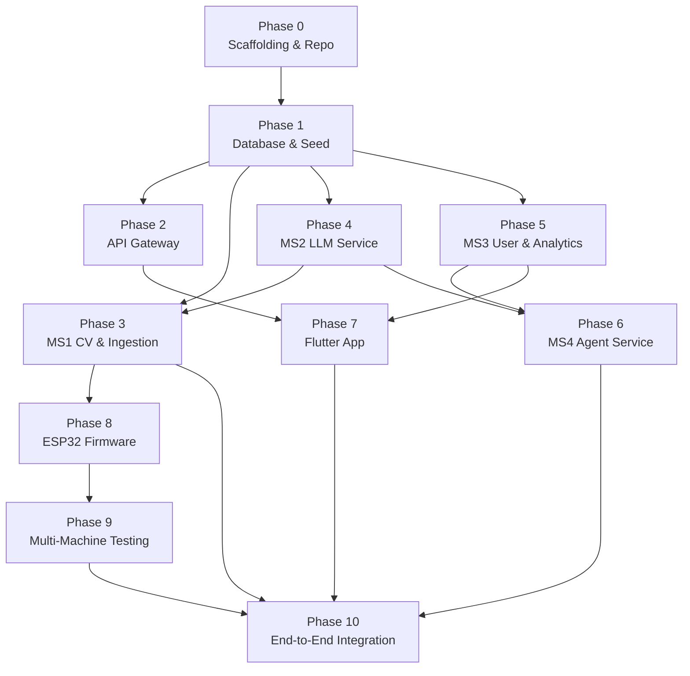

# NutriX — Master Implementation Plan

> **Goal:** A fully functional, locally-running, fully Dockerized NutriX system across 4 microservices.
> Each microservice can run on a separate machine on the same local network.
> No cloud deployment yet. Every component works end-to-end before moving to the next phase.

---

## What Is Already Done

| Component | Status | Notes |
|---|---|---|
| **YOLO Model** (`nutrix_yolo_custom.pt`) | Done | 123-class custom trained model. Weights exist. |
| **YOLOv8 Retrained Weights** (`yolov8_retrained.pt`) | Done | HitL fine-tuned weights exist. |
| **CV Engine** (`cv_engine.py`) | Mostly Done | Inference, delta weight, session tracking, pending save. Missing: Per-user head adapter swapping, barcode decode, DB write. |
| **HitL Engine** (`hitl_engine.py`) | Mostly Done | Annotation generation exists. Missing: `freeze=10` adapter-only retraining, `user_adapters` table save. |
| **Retrain Script** (`retrain_yolo.py`) | Done | Full retraining exists. Needs modification for head-only `freeze=10` with user-scoped output. |
| **ESP32 Stream to Python** | Done | `esp32_inference.py` can receive scale stream. |
| **MS3: User & Analytics Service** | Done (per user) | Auth, profiles, recipe engine, meal logs, OR-Tools planner. |
| **Dataset Pipeline** (`download_and_combine_datasets.py`) | Done | Roboflow download + remapping pipeline exists. |

---

## What Needs to Be Built

---

## Phase 0 — Project Scaffolding & Repo Setup
> **Goal:** A clean monorepo structure that any teammate can clone and `docker-compose up` to run.

- [x] 0.1 Set up GitHub Organization repo (`NutriX-Platform`)
- [x] 0.2 Define final monorepo folder structure matching the architecture
- [x] 0.3 Create root `docker-compose.yml` with all 4 services + PostgreSQL + Redis containers
- [x] 0.4 Create per-service `Dockerfile` stubs for MS1, MS2, MS3, MS4
- [x] 0.5 Create shared `.env` file template (DB credentials, device token, secrets)
- [x] 0.6 Create `docker-compose.override.yml` for local IP overrides (for multi-machine setup)
- [x] 0.7 Create root `requirements.txt` per service (MS1, MS2, MS3, MS4 each have own deps)
- [x] 0.8 Set up GitHub Actions CI stubs (path-filtered per service)

---

## Phase 1 — Data & Database Foundation
> **Goal:** PostgreSQL is fully seeded and Redis is running. All services can connect to both.

- [ ] 1.1 Design and finalize full PostgreSQL schema (all tables from ER diagram, including `user_adapters`)
- [ ] 1.2 Write SQLAlchemy ORM models for every table (`users`, `profiles`, `meal_logs`, `foods`, `food_nutrients`, `recipes`, `user_adapters`, `audit_logs`, `clinical_alerts`, etc.)
- [ ] 1.3 Create Alembic migration setup (schema changes are versioned)
- [ ] 1.4 Write database seeder scripts:
  - Seed `foods` + `food_nutrients` from ICMR INDB, USDA FDC CSV datasets
  - Seed `recipes` + `recipe_nutrition` + `recipe_ingredients` from `recipes.xlsx`
  - Seed `food_aliases` (Indian regional synonyms map)
  - Seed `food_portions` (unit-to-gram conversions from `Units.xlsx`)
- [ ] 1.5 Write and test PostgreSQL trigger: After INSERT on `meal_logs`, auto-recalculate + push daily totals to Redis
- [ ] 1.6 Verify Redis connection and stream setup (`user:{id}:macro_stream`)
- [ ] 1.7 Database connection health check endpoint on each service

---

## Phase 2 — API Gateway (Port 8000)
> **Goal:** Single authenticated front door. Routes all requests to the correct internal service.

- [ ] 2.1 Create FastAPI gateway app (`gateway/main.py`)
- [ ] 2.2 Implement JWT Bearer token validation middleware
- [ ] 2.3 Implement Device-Token validation middleware for scale requests
- [ ] 2.4 Implement `httpx` async reverse proxy routing to all 4 internal services
- [ ] 2.5 Add request logging middleware (log every inbound request + destination)
- [ ] 2.6 Write Dockerfile for gateway service (CPU: `python:3.11-slim`)
- [ ] 2.7 Test: Scale POST and Flutter GET requests route correctly through gateway

---

## Phase 3 — MS1: CV & Ingestion Service (Port 8001)
> **Goal:** Scale telemetry uploads hit MS1, food is identified, macros retrieved, meal log written to DB.

**What exists:** `cv_engine.py`, `hitl_engine.py`, `retrain_yolo.py`, trained `.pt` weights, `esp32_inference.py`

**What is missing:**

- [ ] 3.1 Wrap CV Engine in a FastAPI app (`ms1/main.py`) exposing:
  - `POST /v1/ingest/weight-frame` (receives multipart from gateway)
  - `POST /api/hitl/confirm` (user confirms/edits unidentified item)
  - `GET /api/barcode/{barcode}` (barcode lookup handler)
  - `POST /api/ocr/upload` (OCR image to macros)
- [ ] 3.2 Add OpenCV barcode decode path inside `cv_engine.py` (using `pyzbar`)
- [ ] 3.3 Add PostgreSQL food lookup after identification (check `foods` table before calling MS2)
- [ ] 3.4 Add OpenFoodFacts / USDA API fallback lookup (for barcode misses)
- [ ] 3.5 Add MS2 LLM nutrition lookup call (`POST http://llm-service:8003/v1/llm/lookup`) for unknown foods
- [ ] 3.6 Add MS2 Pre-HitL Vision call (`POST http://llm-service:8003/v1/llm/vision-infer`) when YOLO < 80%
- [ ] 3.7 Add PostgreSQL `meal_logs` INSERT after food confirmed
- [ ] 3.8 Modify `retrain_yolo.py` to support `freeze=10` adapter-only retraining with per-user output path
- [ ] 3.9 Modify `hitl_engine.py` to save adapter weights path to `user_adapters` table after retraining
- [ ] 3.10 Implement Per-User Head Adapter loading in `cv_engine.py` (load user head from DB/disk, swap on inference)
- [ ] 3.11 Add execution trace logging to `audit_logs` table after each inference
- [ ] 3.12 Write Dockerfile for MS1 (GPU-enabled base: `ultralytics/ultralytics`)
- [ ] 3.13 Integration test: Full scale-to-DB flow end-to-end with a real image

---

## Phase 4 — MS2: LLM Nutrition & Vision Service (Port 8003)
> **Goal:** Local LLM runs nutrition text lookup AND vision inference on unidentified food images.

- [ ] 4.1 Choose and pull local model: Qwen2.5-7B-Instruct via Ollama (dev) or vLLM (production)
- [ ] 4.2 Create FastAPI app (`ms2/main.py`) exposing:
  - `POST /v1/llm/lookup` — text nutrition generation (food name to JSON macros)
  - `POST /v1/llm/vision-infer` — image to food candidate name + macro estimate
  - `POST /v1/llm/generate` — raw prompt to completion (used by MS4 agents)
- [ ] 4.3 Implement structured prompt template for nutrition lookup (strict JSON output enforcement)
- [ ] 4.4 Implement multimodal vision prompt for pre-HitL image inference (Qwen2.5-VL or Gemini Vision fallback)
- [ ] 4.5 Add 10-second timeout handling and `llm-timeout` fallback response
- [ ] 4.6 Add INSERT to `foods` + `food_nutrients` table for newly inferred foods
- [ ] 4.7 Add execution trace logging to `audit_logs`
- [ ] 4.8 Write Dockerfile for MS2 (GPU base: Ollama Docker image or `nvidia/cuda`)
- [ ] 4.9 Integration test: `POST /v1/llm/lookup` returns valid macro JSON; vision call returns a plausible food name

---

## Phase 5 — MS3: User & Analytics Service (Port 8002)
> **Goal:** All app-facing endpoints verified, containerized, and talking to the shared PostgreSQL + Redis.

**Status: Already implemented. Main tasks are integration and containerization.**

- [ ] 5.1 Audit all MS3 endpoints against the route table in `MASTER_ARCHITECTURE.md`
- [ ] 5.2 Verify Auth endpoints: `register`, `login` (Bcrypt), Google OAuth, `me` (JWT decode)
- [ ] 5.3 Verify Profile endpoints: `GET/PUT /api/users/{id}`, dietary preferences write
- [ ] 5.4 Verify Analytics: `GET /v1/user/daily-summary` reads from Redis correctly
- [ ] 5.5 Verify OR-Tools Meal Planner: `POST /api/meal-plans/generate` runs LP solver correctly
- [ ] 5.6 Verify Recipe Recommendation: `POST /api/recipes/recommend` queries seeded recipe DB
- [ ] 5.7 Verify Homely Meal Builder: unit-to-gram conversion and `homely_meal_nutrition` write
- [ ] 5.8 Verify Barcode Alternatives and Dietary Classifier endpoints
- [ ] 5.9 Switch DB from SQLite (dev) to PostgreSQL if not already done
- [ ] 5.10 Write Dockerfile for MS3 (CPU: `python:3.11-slim`)
- [ ] 5.11 Integration test: Full auth to profile to meal plan flow from a REST client

---

## Phase 6 — MS4: Multi-Agent System Service (Port 8004)
> **Goal:** All 4 agent tiers run as async background workers and respond to real events.

- [ ] 6.1 Create FastAPI app (`ms4/main.py`) exposing `POST /api/agent/query`
- [ ] 6.2 Tier 1: Orchestrator Interface Agent
  - Intent classifier (calls MS2 `/v1/llm/generate` with a routing prompt)
  - Tool registry: `query_macros`, `log_meal`, `get_daily_summary`, `recommend_recipes`, `generate_meal_plan`
  - Route classified intent to correct tool function and return response
- [ ] 6.3 Tier 2A: Outlier Guardian Agent
  - Async Redis Stream subscriber (`XREAD user:{id}:macro_stream`)
  - Clinical threshold matrix evaluation (diabetic, hypertensive, protein deficit, caloric excess)
  - L1: Push Flutter notification; L2: INSERT `clinical_alerts`; L3: Trigger Tier 2B MDT
- [ ] 6.4 Tier 2B: Multi-Agent Clinical MDT
  - Diagnostic Agent: Pull 30-day `meal_logs` + `weight_logs`, run NOVA flags
  - Intervention Agent: Run OR-Tools LP solver with deficit constraint vector
  - Drafting Agent: LLM-generated structured clinical report via MS2 → INSERT `clinical_reports`
- [ ] 6.5 Tier 3: Meta-Auditor & Self-Healing Agent
  - 15-minute scheduled audit cycle (`asyncio` background task)
  - Pull execution traces from `audit_logs`
  - Compute S_faith score per trace vs. ICMR/USDA ground truth in PostgreSQL
  - On LLM hallucination: Patch system prompt registry in DB
  - On CV drift: Trigger MS1 retrain via internal HTTP call
- [ ] 6.6 Write Dockerfile for MS4 (CPU: `python:3.11-slim`)
- [ ] 6.7 Integration test: NL query returns correct answer; Guardian fires on simulated threshold breach

---

## Phase 7 — Flutter Mobile App
> **Goal:** All Flutter screens connect to live backend through the API gateway on the local network.

- [ ] 7.1 Set gateway base URL in `ApiClient` (configurable env variable for local IP)
- [ ] 7.2 Auth flow: Register / Login / Google OAuth → store JWT in Android Keystore
- [ ] 7.3 Home Dashboard: Macro progress rings from `GET /v1/user/daily-summary`
- [ ] 7.4 Meal History: Pull from `GET /v1/user/history`
- [ ] 7.5 Barcode Scanner screen: Call `GET /api/barcode/{barcode}`
- [ ] 7.6 HitL Confirmation screen: Push notification → show AI candidate → user confirms/edits → `POST /api/hitl/confirm`
- [ ] 7.7 Recipe Discovery: `POST /api/recipes/recommend` with pantry ingredients
- [ ] 7.8 AI Coach: `POST /api/agent/query` with text/voice input
- [ ] 7.9 Meal Plan Generator: `POST /api/meal-plans/generate` → display 4-slot plan
- [ ] 7.10 Homely Builder screen: Ingredient + unit entry → real-time macro calculation
- [ ] 7.11 Integration test: Full happy path — login → scale event → meal logged → dashboard updated

---

## Phase 8 — ESP32-S3 Firmware Finalization
> **Goal:** Physical scale sends correctly formatted multipart POST to the gateway on the local network.

- [ ] 8.1 Verify HX711 weight stabilization algorithm (sigma < 0.5g for 500ms)
- [ ] 8.2 Verify OV2640 JPEG capture triggers correctly after stable weight event
- [ ] 8.3 Verify multipart HTTP POST construction (`weight`, `image`, `Device-Token`, `User-ID` headers)
- [ ] 8.4 Make gateway IP configurable in firmware (not hardcoded)
- [ ] 8.5 Full cycle test: Scale fires → gateway → MS1 → DB → Redis → Flutter dashboard updates

---

## Phase 9 — Multi-Machine Local Network Deployment
> **Goal:** Each container runs on a different physical device on the same LAN. Everything talks correctly.

- [ ] 9.1 Document machine assignment: which device runs which service
- [ ] 9.2 Create `docker-compose.network.yml` with external IP overrides per machine
- [ ] 9.3 Test cross-machine internal service calls (MS1 calling MS2 over local network)
- [ ] 9.4 Verify ESP32 can reach the gateway machine's IP from across the room
- [ ] 9.5 Verify Flutter app on phone can reach gateway on the same WiFi network
- [ ] 9.6 Write per-service quick-start `README.md` (purpose, env vars, how to run)

---

## Phase 10 — End-to-End Integration & Quality Pass
> **Goal:** Every single user flow in the architecture runs without error on real hardware.

- [ ] 10.1 Flow 1: Known food auto-identification → scale → DB → Redis → Flutter live counter update
- [ ] 10.2 Flow 2: Low-confidence → Pre-HitL LLM Vision → user 1-tap confirm → adapter retrain
- [ ] 10.3 Flow 3: Guardian Agent fires on dietary threshold breach → MDT clinical report to app
- [ ] 10.4 Flow 4: Meta-Auditor detects seeded bad LLM trace → patches system prompt autonomously
- [ ] 10.5 API contract review: Every endpoint returns correct schema
- [ ] 10.6 Error handling pass: Every service handles its dependency being offline gracefully
- [ ] 10.7 Demo recording: Full end-to-end scale-to-phone live session

---

## Build Dependency Order

> Build MS2 (LLM Service) before completing MS1 and MS4 since both depend on it for LLM calls.
> MS3 is mostly done — containerize it early so auth and profile endpoints are available to other phases.

---

## Port & Machine Reference

| Service | Port | Hardware Requirement |
|---|---|---|
| API Gateway | 8000 | Any machine (public-facing on LAN) |
| MS1: CV & Ingestion | 8001 | Machine with GPU (for YOLOv8) |
| MS3: User & Analytics | 8002 | Any CPU machine |
| MS2: LLM Service | 8003 | Machine with GPU (6-14GB VRAM) |
| MS4: Agent Service | 8004 | Any CPU machine |
| PostgreSQL | 5432 | Any machine with persistent storage |
| Redis | 6379 | Same machine as PostgreSQL or dedicated |
