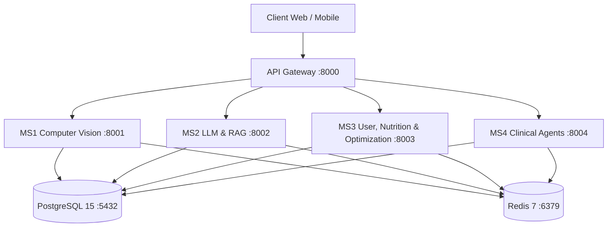

# WACV 2027 Technical Audit: Core Architecture & Microservices

**Target Repository:** `NutriX-Intelligence/NutriX-Platform`  
**Scope:** Microservices Architecture, API Gateway, Database Schemas, Docker Infrastructure, and Shared Libraries.

---

## 1. Overview of Platform Architecture

NutriX is architected as a modular microservices platform leveraging FastAPI, SQLAlchemy 2.0 ORM, PostgreSQL 15, Redis 7, and Docker Compose. Communication between services is orchestrated via an API Gateway routing requests to specialized microservices.

---

## 2. Microservices Breakdown

Defined in [docker-compose.yml](file:///wsl.localhost/Ubuntu/home/harsh/Nutrix/docker-compose.yml):

### 2.1 Service Detail Inventory

1. **API Gateway (`gateway`)**
   * **Path:** [gateway/](file:///wsl.localhost/Ubuntu/home/harsh/Nutrix/gateway/)
   * **Port:** `8000:8000`
   * **Purpose:** Single entry-point API routing and authentication header pass-through.
2. **MS1 Computer Vision Service (`ms1_cv`)**
   * **Path:** [ms1_cv/](file:///wsl.localhost/Ubuntu/home/harsh/Nutrix/ms1_cv/)
   * **Port:** `8001:8001`
   * **Modules:** `cv_engine.py` (YOLO scale event processing), `hitl_engine.py` (Human-in-the-loop active learning), `retrain_yolo.py`.
   * **Weights:** `nutrix_yolo_custom.pt` (123-class custom model) and `yolov8_retrained.pt`.
3. **MS2 LLM & RAG Engine Service (`ms2_llm`)**
   * **Path:** [ms2_llm/](file:///wsl.localhost/Ubuntu/home/harsh/Nutrix/ms2_llm/)
   * **Port:** `8002:8002`
   * **Purpose:** LLM query processing and vector search RAG integration.
4. **MS3 User, Nutrition, Optimization & Core Service (`ms3_user`)**
   * **Path:** [ms3_user/](file:///wsl.localhost/Ubuntu/home/harsh/Nutrix/ms3_user/) and nested [ms3_user/NutriX-main/NutriX-main/app/](file:///wsl.localhost/Ubuntu/home/harsh/Nutrix/ms3_user/NutriX-main/NutriX-main/app/)
   * **Port:** `8003:8003`
   * **Modules:** `nutrition_engine.py`, `optimization_engine.py` (Google OR-Tools MILP solver), `homely_meals_engine.py`, `barcode_service.py` (4-tier fallback), `ocr_engine.py` (EasyOCR), `ingredient_matcher.py`, `explanation_engine.py`, `health_scorer.py`.
5. **MS4 Clinical Guardian & Multi-Agent Service (`ms4_agents`)**
   * **Path:** [ms4_agents/](file:///wsl.localhost/Ubuntu/home/harsh/Nutrix/ms4_agents/)
   * **Port:** `8004:8004`
   * **Purpose:** Multi-agent clinical monitoring, alert generation, and prompt registry oversight.

---

## 3. Shared Infrastructure & Database Layer (`shared/`)

Located in [shared/](file:///wsl.localhost/Ubuntu/home/harsh/Nutrix/shared/):

* **[shared/db.py](file:///wsl.localhost/Ubuntu/home/harsh/Nutrix/shared/db.py):** Database engine instantiation and session dependency (`get_db`) configured for PostgreSQL (`postgresql+psycopg2://...`) with fallback SQLite connection.
* **[shared/models.py](file:///wsl.localhost/Ubuntu/home/harsh/Nutrix/shared/models.py):** Contains 34 SQLAlchemy database models:
  * **User & Health Profile:** `User`, `Profile`, `UserPreference`, `Goal`, `Settings`, `WeightLog`, `WaterLog`, `MealLog`.
  * **Food Science & Nutrition:** `Food`, `FoodCategory`, `FoodNutrient`, `FoodPortion`, `FoodAlias`, `FoodTag`, `UnitConversion`.
  * **Recipes & Servings:** `Recipe`, `RecipeIngredient`, `RecipeNutrition`, `RecipeStep`, `Serving`, `Ingredient`, `IngredientRule`.
  * **Planning & Recommendations:** `GeneratedMealPlan`, `RecommendationHistory`, `HealthScore`, `Analytics`, `SearchHistory`.
  * **Packaged Foods:** `BarcodeCache`.
  * **Homely Meals (Community & Custom):** `HomelyMeal`, `HomelyMealIngredient`, `HomelyMealNutrition`, `HomelyMealVersion`, `HomelyMealReview`, `HomelyMealTag`.
  * **Microservice & Agentic Control:** `UserAdapter`, `AuditLog`, `ClinicalAlert`, `ClinicalReport`, `SystemPromptRegistry`.
* **[shared/redis_client.py](file:///wsl.localhost/Ubuntu/home/harsh/Nutrix/shared/redis_client.py):** Redis connection management and JSON caching layer.
* **[shared/audit.py](file:///wsl.localhost/Ubuntu/home/harsh/Nutrix/shared/audit.py):** Service operation logging to `audit_logs` table.
* **[shared/health.py](file:///wsl.localhost/Ubuntu/home/harsh/Nutrix/shared/health.py):** Unified health check function (`check_health`) verifying database connectivity, table count, and Redis status.
