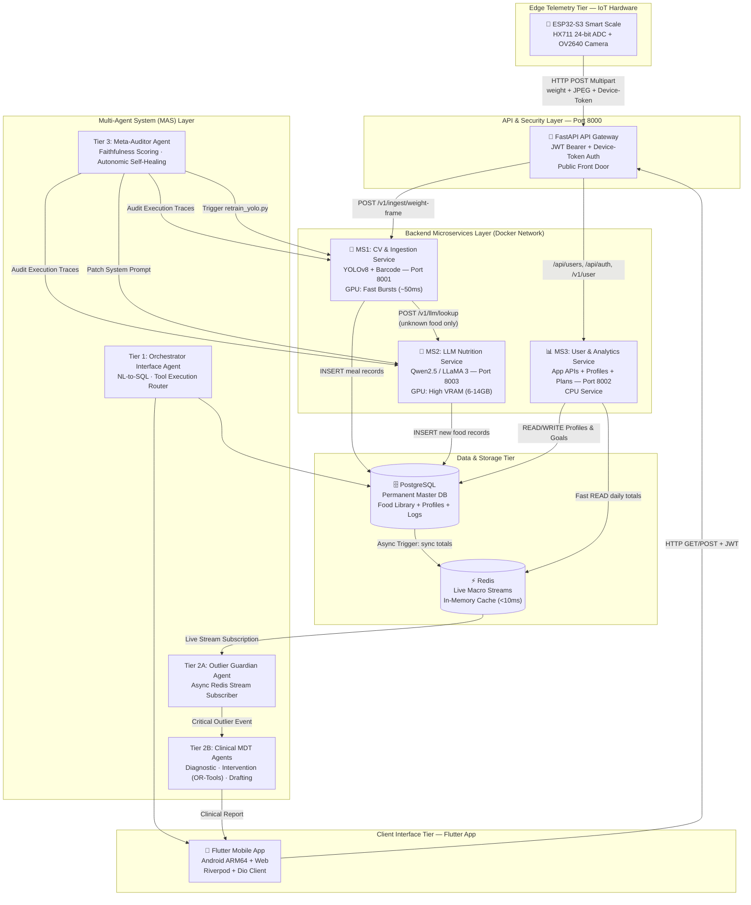

# NutriX — Complete Architecture Deep Dive & Master Reference

> **Project:** NutriX Smart Scale AI Food Tracker & Cognitive Healthcare Platform
> **Note:** This file is kept in sync with `docs/MASTER_ARCHITECTURE.md` as the unified technical blueprint for the repository.

---

## Executive Summary & System Overview

NutriX is an end-to-end, edge-to-cloud cognitive dietary tracking and clinical informatics ecosystem comprising three core tiers:
1. **Edge Telemetry Tier**: An ESP32-S3 physical smart scale equipped with an HX711 24-bit ADC weight sensor and an OV2640 camera module that detects weight stabilization and captures high-resolution food frames automatically.
2. **Cloud Microservices Engine**: A 3-microservice backend built with FastAPI, containerized via Docker, featuring Ultralytics YOLOv8 computer vision (123 food classes), OpenCV barcode decoding, self-hosted local Qwen2.5/LLaMA LLM inference, and dual-database state management (PostgreSQL + Redis).
3. **Multi-Agent System (MAS) Framework**: A 4-tier autonomous agent layer operating over async Redis Streams and PostgreSQL execution traces. It features an Orchestrator Interface Agent (Tier 1), an Event-Driven Outlier Guardian (Tier 2A), a Multi-Agent Clinical MDT (Tier 2B), and an Autonomic Meta-Auditor Agent (Tier 3) capable of self-healing pipeline drift without human developer intervention.
4. **Client Interface Tier**: A cross-platform Flutter application (Android ARM64 + Web) powered by Riverpod state management, Dio HTTP interceptors, Android Keystore JWT security, and biometric re-authentication.

---

## Layer 1 — Edge Telemetry Tier (ESP32-S3 Smart Scale)

**Hardware:** ESP32-S3 (Freenove model) with an OV2640 Camera Module and HX711 24-bit Load Cell ADC.

### 1. Weight Stabilization Algorithm
The scale functions as an intelligent edge telemetry node. It continuously samples the 24-bit HX711 ADC and executes an on-device moving window calculation. It only triggers a capture event when the standard deviation ($\sigma$) of weight readings satisfies:

$$\sigma_{\text{weight}} < 0.5\text{g} \quad \text{sustained continuously for } 500\text{ms}$$

This prevents false capture triggers from hand movements or mechanical settle vibrations.

### 2. HTTP Multipart Form-Data Payload Specification
Once weight stability is confirmed, the ESP32-S3 captures a JPEG image buffer from the OV2640 camera and transmits a single atomic **HTTP POST Multipart Form-Data** request to the API Gateway (`POST /v1/ingest/weight-frame`):

| Payload Field | Data Type | Example Value | Description |
|---|---|---|---|
| `weight` | Text Form Field | `245.3` | Stable weight reading in grams |
| `image` | Binary JPEG | `[raw bytes]` | Captured frame buffer from OV2640 camera |
| `Device-Token` | HTTP Header | `NutriX_ESP32_SECURE_TOKEN_9921` | Hardware authentication token |
| `User-ID` | HTTP Header | `usr_882910` | Unique user identity linked to scale |

---

## Layer 2 — API Gateway Tier (Single Front Door)

**Tech:** FastAPI (Python) | **Port 8000** | Exposed publicly to edge scale and mobile clients.

### Responsibilities
- **Authentication**: Validates `Device-Token` for physical scales and `JWT Bearer Token` for Flutter mobile apps.
- **Request Routing**: Directs heavy vision uploads to MS1 and application/user management endpoints to MS3.
- **Security Boundary**: Isolates internal Docker microservice ports (8001, 8002, 8003, 8004, 5432, 6379) from direct external network exposure.

### Complete Gateway Route Table

| Method | Route | Target Service | Purpose |
|---|---|---|---|
| `POST` | `/v1/ingest/weight-frame` | MS1: CV & Ingestion | Scale telemetry upload (Vision + Weight) |
| `POST` | `/api/auth/register`, `/login`, `/google` | MS3: User & Analytics | User authentication & JWT generation |
| `GET` | `/api/auth/me` | MS3: User & Analytics | Currently authenticated user profile |
| `GET`, `PUT` | `/api/users/{id}` | MS3: User & Analytics | Profile demographics (age, height, weight, goals) |
| `POST` | `/api/users/{id}/preferences` | MS3: User & Analytics | Dietary rules (Vegan, Jain, allergies) |
| `GET` | `/v1/user/daily-summary` | MS3: User & Analytics | Fast Redis read for today's macro progress |
| `GET` | `/v1/user/history` | MS3: User & Analytics | Timestamped meal log history |
| `GET` | `/v1/user/targets` | MS3: User & Analytics | Daily BMR/TDEE target breakdown |
| `POST` | `/api/recipes/recommend` | MS3: User & Analytics | Ingredient-based recipe ranking |
| `POST` | `/api/recipes/generate-instructions` | MS3: User & Analytics | Step-by-step cooking guidance |
| `GET` | `/api/barcode/{barcode}` | MS1: CV & Ingestion | Product lookup via cache / OpenFoodFacts |
| `POST` | `/api/barcode/alternatives` | MS3: User & Analytics | Healthier & cheaper alternative suggestions |
| `POST` | `/api/classify` | MS3: User & Analytics | Ingredient dietary compliance classification |
| `POST` | `/api/ocr/upload` | MS1: CV & Ingestion | Nutrition label text extraction |
| `POST` | `/api/meal-logs` | MS3: User & Analytics | Manual meal entry logging |
| `POST` | `/api/meal-plans/generate` | MS3: User & Analytics | Google OR-Tools 4-slot meal plan solver |
| `POST` | `/api/ai/coach` | MS3: User & Analytics | Conversational diet coaching |
| `POST` | `/v1/llm/lookup` | MS2: LLM Nutrition | Internal service call for unknown foods |

---

### Layer 3 — Backend Microservices Architecture (4 Containers)

- **Microservice 1: CV & Ingestion Service (Port 8001, GPU)**:
  - Tech: FastAPI + Ultralytics YOLOv8 (`NutriX_yolo_custom.pt`, 123 classes baseline) + OpenCV Barcode.
  - YOLO Adapter Architecture: Shared frozen backbone/neck (Layers 0–9 in VRAM once) + Per-User Head Adapters (`user_{id}_head.pt`, ~400KB) dynamically attached at inference based on `User-ID`.
  - Pre-HitL LLM Vision Fallback: If YOLO confidence is < 80%, MS1 invokes MS2 (`POST /v1/llm/vision-infer`) to generate a candidate suggestion (*"Paneer Tikka (240 kcal)"*) for 1-tap user confirmation.
  - HitL Engine: Upon user confirmation/edit, saves pair to `/dataset/trained/user_{id}/`, executes `freeze=10` head-only fine-tuning in ~3s via `retrain_yolo.py`, and updates `user_adapters` table.

- **Microservice 2: LLM Nutrition & Vision Service (Port 8003, GPU)**:
  - Tech: FastAPI + Ollama (dev) / vLLM (prod) serving **Qwen2.5-7B-Instruct** / **Qwen2.5-VL** or **LLaMA 3.1** (6–14GB VRAM).
  - Dual Endpoints: `POST /v1/llm/lookup` (text-to-nutrition generation) & `POST /v1/llm/vision-infer` (pre-HitL vision inference).

- **Microservice 3: User Management & Analytics Service (Port 8002, CPU)**:
  - Tech: FastAPI + Python + SQLAlchemy ORM + Google OR-Tools + Redis.
  - Function: Writes user profiles, auth credentials, custom meals to PostgreSQL; reads live dashboard totals from Redis (<10ms).

- **Microservice 4: Multi-Agent System (MAS) Service (Port 8004, CPU/LLM Orchestration)**:
  - Tech: FastAPI + Python `asyncio` + Redis Streams (`user:{id}:macro_stream`) + LangChain / LlamaIndex / Custom Agent Loops.
  - Function: Runs Tier 1 Orchestrator (NL-to-SQL & Tool Calls), Tier 2A Patient Guardian, Tier 2B Clinical MDT (OR-Tools LP Solver), and Tier 3 Meta-Auditor Agent ($S_{\text{faith}}$ self-healing).

---

## Layer 4 — Data & Storage Tier (PostgreSQL + Redis Hybrid)
- **PostgreSQL**: Relational storage for accounts, profiles, food library, meal logs, recipe master data, and execution audit traces.
- **Redis**: In-memory cache for live daily calorie/macro running totals (`user:101:daily_calories`) and pub/sub event streams (`user:101:macro_stream`).

---

## Layer 5 — Multi-Agent System (MAS) Framework
- **Agent Tuple**: $\mathcal{A} = \langle \mathcal{S}, \mathcal{O}, \mathcal{A}_c, \mathcal{T}, \mathcal{R} \rangle$.
- **Tier 1 (Orchestrator)**: Converts NL inputs to tool function calls (`query_macros`, `log_meal`, `recommend_recipes`).
- **Tier 2A (Patient Guardian)**: Subscribes to Redis Streams to detect glycemic, protein, sodium, and caloric anomalies asynchronously.
- **Tier 2B (Clinical MDT)**: Diagnostic Agent scans 30-day logs $\rightarrow$ Intervention Agent solves OR-Tools LP model $\rightarrow$ Drafting Agent generates clinical report for dietitian sign-off.
- **Tier 3 (Meta-Auditor)**: Evaluates $S_{\text{faith}}$ score against ground-truth tables; self-heals by patching LLM system prompts or auto-retraining YOLOv8.

---

## Datasets, Cloud Infrastructure & File Structure
Refer to `docs/MASTER_ARCHITECTURE.md` for the complete dataset tables, Docker compose mappings, and full project directory maps.
