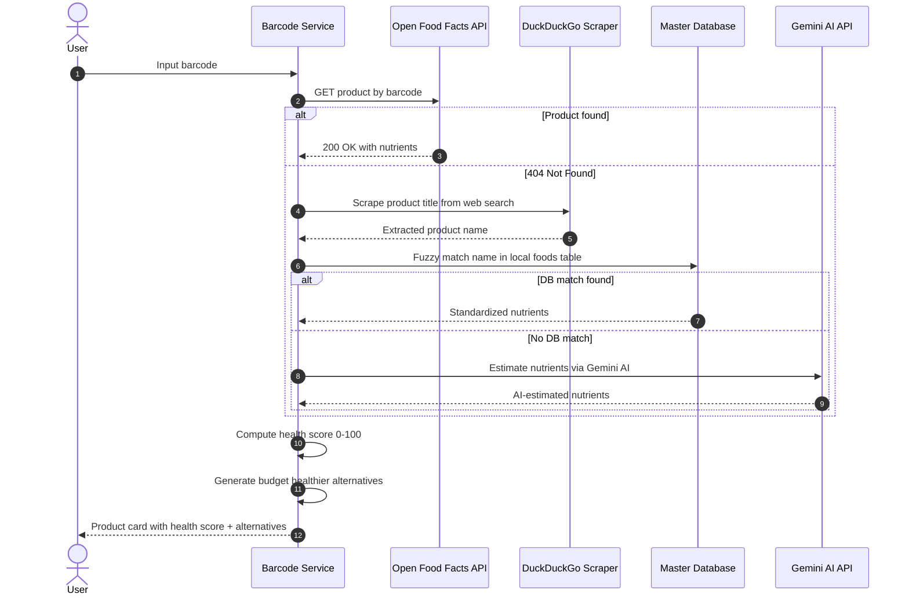
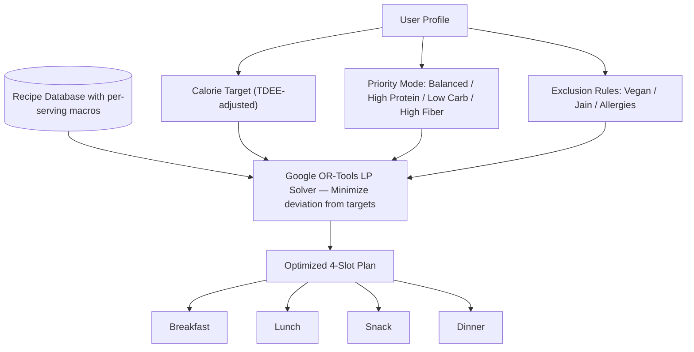
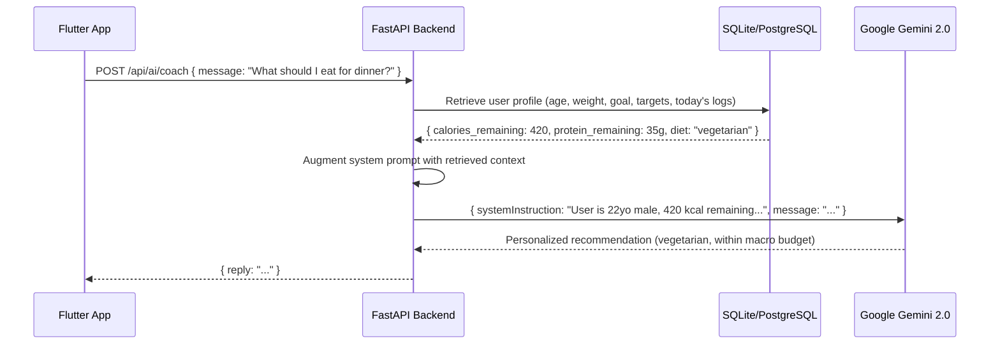
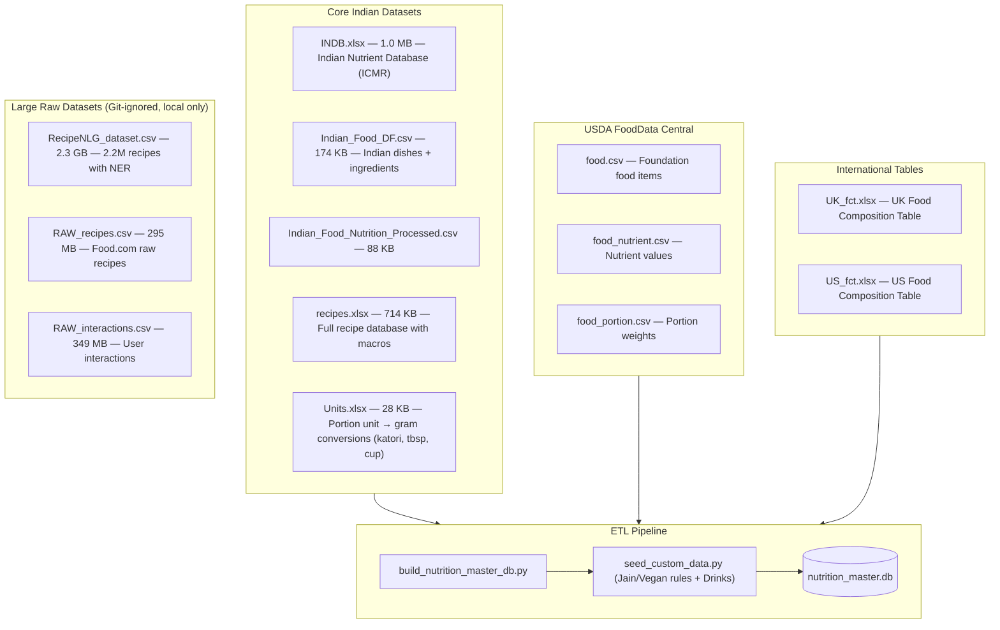
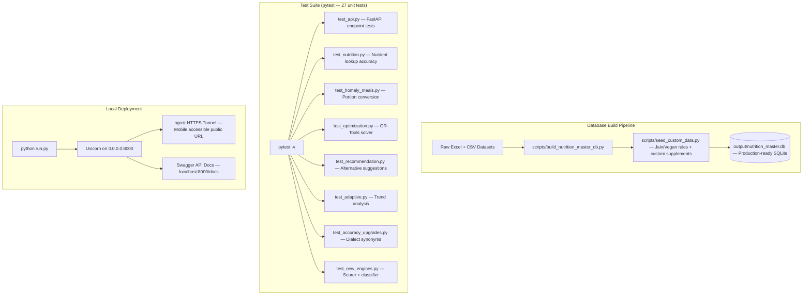

# NutriX — Complete Backend Architecture

> **Version:** 1.0.0 | **Framework:** FastAPI (Python) | **Server:** Uvicorn (ASGI)

---

## 1. System Overview

The NutriX backend is the intelligence layer of the entire platform. It is a **production-grade, asynchronous REST API** built with Python's FastAPI framework, responsible for all user authentication, AI-driven dietary recommendations, nutrition computation, meal planning, barcode scanning, OCR processing, and analytical reporting.

It communicates exclusively with the Flutter frontend via **HTTP/JSON REST APIs**, secured by **JWT Bearer Tokens**.

---

## 2. High-Level Architecture Diagram

```mermaid
graph TD
    subgraph CLIENT["Client Layer"]
        MOB["📱 Flutter Android App"]
        WEB["🌐 Web Browser (Flutter Web)"]
    end

    subgraph GATEWAY["API & Security Layer"]
        CORS["CORS Middleware"]
        FastAPI["FastAPI App Server (Uvicorn ASGI)"]
        JWT["JWT Auth Guard — auth_service.py"]
        SCHEMA["Pydantic V2 Schemas — schemas.py + schemas_recipes.py"]
    end

    subgraph ENGINES["Domain Intelligence Engines"]
        Auth["🔐 Auth Router"]
        Profile["👤 User Profile Router"]
        Recipes["🍽️ Recipe Engine Router"]
        Homely["🏠 Homely Builder Router"]
        Barcode["📦 Barcode Scanner Router"]
        OCR["🖼️ OCR Label Router"]
        Classify["🥗 Dietary Classifier Router"]
        Analytics["📊 Analytics Router"]
        MealPlan["📅 Meal Plan Router"]
        AICoach["🤖 AI Coach Router"]
    end

    subgraph SERVICES["Service Modules"]
        AuthSvc["auth_service.py (Bcrypt + JWT)"]
        RecipeRanker["recipe_ranker.py"]
        IngMatcher["ingredient_matcher.py (RapidFuzz)"]
        RecEngine["recommendation_engine.py"]
        HealthScorer["health_scorer.py"]
        HomelyEngine["homely_meals_engine.py"]
        BarcodeSvc["barcode_service.py"]
        OCREngine["ocr_engine.py (EasyOCR + Gemini Vision)"]
        ClassEngine["classification_engine.py"]
        AnalyticsEngine["analytics_engine.py"]
        NutritionEng["nutrition_engine.py (BMR/TDEE)"]
        AdaptivePlan["adaptive_planner.py"]
        OptEngine["optimization_engine.py (OR-Tools LP)"]
        ExplainEng["explanation_engine.py"]
        MLExt["ml_extension.py (scikit-learn + XGBoost)"]
    end

    subgraph EXTERNAL["External APIs"]
        OFF["Open Food Facts API"]
        DDG["DuckDuckGo Scraper (404 fallback)"]
        GeminiAPI["Google Gemini 2.0 Flash"]
        GAuth["Google OAuth 2.0"]
    end

    subgraph DATA["Data & Storage Layer"]
        DB[("SQLAlchemy ORM")]
        IDX["In-Memory Fuzzy Index (RapidFuzz)"]
        SQLite["SQLite — nutrition_master.db (Dev)"]
        Postgres["PostgreSQL (Production)"]
    end

    MOB --> CORS
    WEB --> CORS
    CORS --> FastAPI
    FastAPI --> JWT
    JWT --> SCHEMA
    SCHEMA --> Auth & Profile & Recipes & Homely & Barcode & OCR & Classify & Analytics & MealPlan & AICoach

    Auth --> AuthSvc
    Recipes --> RecipeRanker & IngMatcher & RecEngine & HealthScorer
    Homely --> HomelyEngine
    Barcode --> BarcodeSvc
    OCR --> OCREngine
    Classify --> ClassEngine
    Analytics --> AnalyticsEngine
    MealPlan --> NutritionEng & AdaptivePlan & OptEngine
    AICoach -->|"Relational RAG"| DB
    AICoach -->|"Augmented Prompt"| GeminiAPI

    BarcodeSvc -->|"1st"| OFF
    BarcodeSvc -->|"404 fallback"| DDG
    BarcodeSvc -->|"AI backup"| GeminiAPI
    OCREngine -->|"Vision API"| GeminiAPI
    AuthSvc --> GAuth
    IngMatcher --> IDX

    AuthSvc & RecEngine & HomelyEngine & BarcodeSvc & ClassEngine & AnalyticsEngine & AdaptivePlan & NutritionEng & OptEngine --> DB
    DB --> SQLite
    DB -.->|"Via DATABASE_URL env var"| Postgres
```

---

## 3. Barcode Multi-Tier Fallback Sequence

The `barcode_service.py` uses a sophisticated **4-tier fallback chain** to always return a result:

---

## 4. Diet Plan Optimization Solver (OR-Tools)

The `optimization_engine.py` uses **Google OR-Tools Linear Programming** to generate mathematically optimal 4-slot daily meal plans:

---

## 5. Homely Meal Builder Pipeline

---

## 6. Service Modules (app/services/)

The backend is structured into **16 specialized service modules**, each responsible for a single domain:

| Service File | Size | Responsibility |
|---|---|---|
| `auth_service.py` | — | Password hashing (Bcrypt), JWT creation & decoding, Google OAuth ID token verification |
| `nutrition_engine.py` | 4.0 KB | Calculates BMI, BMR (Mifflin-St Jeor equation), TDEE, and macro targets per user goal |
| `recommendation_engine.py` | 12.8 KB | Filters recipes by diet type (Vegan/Vegetarian), macro alignment, budget-aware healthier alternatives |
| `recipe_ranker.py` | 3.9 KB | Composite score per recipe: ingredient coverage × health score × macro fit × dietary preference |
| `ingredient_matcher.py` | 9.9 KB | RapidFuzz fuzzy matching + 100+ Indian synonym map (capsicum↔bell pepper, adrak↔ginger, nimbu↔lemon) |
| `health_scorer.py` | 6.2 KB | 0-100 health score based on ICMR/FDA thresholds; rewards protein/fibre, penalises sugar/sodium/fat |
| `homely_meals_engine.py` | 9.6 KB | Home cooking portion builder: unit conversion (katori, tbsp → grams), cooking fat absorption, macro summation |
| `barcode_service.py` | 11.6 KB | 4-tier fallback: OFF API → DuckDuckGo scraper → local DB fuzzy match → Gemini AI estimation |
| `ocr_engine.py` | 6.5 KB | Nutrition label extraction via EasyOCR + regex patterns + Gemini Vision API fallback |
| `classification_engine.py` | 4.4 KB | Classifies ingredient lists against `ingredient_rules` DB table: Vegan / Vegetarian / Eggetarian / Jain + NOVA processing levels |
| `analytics_engine.py` | 5.0 KB | Aggregates meal/water/weight logs; produces 7-day, 30-day, and 90-day summary metrics |
| `adaptive_planner.py` | 7.1 KB | Moving-average weight trend analysis; auto-adjusts calorie targets if user is off-track |
| `optimization_engine.py` | 14.0 KB | **Google OR-Tools Linear Programming solver** — generates mathematically optimal 4-slot daily plans |
| `explanation_engine.py` | 5.5 KB | Generates human-readable explainable AI reasoning for every recipe recommendation |
| `ml_extension.py` | 8.1 KB | Optional scikit-learn / XGBoost pipeline that learns personalized scores from user interaction history |

---

## 4. Database Schema

The project uses **SQLAlchemy ORM** with a dual-database strategy. In development it uses **SQLite** (`output/nutrition_master.db`). In production, it automatically switches to **PostgreSQL** via the `DATABASE_URL` environment variable.

### Database Tables Overview

```mermaid
erDiagram
    users ||--o| profiles : "has one"
    users ||--o{ meal_logs : "logs"
    users ||--o{ water_logs : "logs"
    users ||--o{ weight_logs : "logs"
    users ||--o{ generated_meal_plans : "has"
    users ||--o{ analytics : "tracked by"
    users ||--o{ homely_meals : "creates"
    users ||--o{ recommendation_history : "receives"
    users ||--o{ search_history : "generates"
    users ||--o{ settings : "configures"

    recipes ||--o| recipe_nutrition : "has"
    recipes ||--o{ recipe_ingredients : "has"
    recipes ||--o{ recipe_steps : "has"
    recipes ||--o| servings : "has"

    foods ||--o| food_nutrients : "has"
    foods ||--o{ food_portions : "has"
    foods ||--o{ food_aliases : "has"
    foods ||--o{ food_tags : "has"

    homely_meals ||--o{ homely_meal_ingredients : "has"
    homely_meals ||--o| homely_meal_nutrition : "has"
    homely_meals ||--o{ homely_meal_reviews : "receives"
    homely_meals ||--o{ homely_meal_tags : "tagged by"
```

### Key Tables Explained

| Table | Description |
|---|---|
| `users` | Core user account: email, hashed password, Google OAuth ID, avatar URL |
| `profiles` | Physical attributes: age, gender, height, weight, activity level, goal, diet type, and all macro targets |
| `foods` | The master Indian food database with food codes, names, and brands |
| `food_nutrients` | Nutritional composition per food: kcal, protein, carbs, fat, fibre, sodium, sugar, calcium, iron, Vitamin C, folate |
| `recipes` | Full recipe index: name, category (Breakfast/Lunch-Dinner/Snack), cuisine, difficulty, cooking time |
| `recipe_ingredients` | Per-ingredient breakdown for each recipe with amounts and units |
| `recipe_nutrition` | Full and per-serving macro breakdown per recipe |
| `meal_logs` | Daily food diary entries per user (food name, calories, protein, carbs, fat, meal type, date) |
| `water_logs` | Daily water intake entries in ml |
| `weight_logs` | Weight check-in history with timestamps for trend analysis |
| `generated_meal_plans` | Structured daily plans linking recipes to Breakfast/Lunch/Dinner/Snack slots |
| `barcode_cache` | Local product cache from Open Food Facts API (avoids redundant API calls) |
| `homely_meals` | User-created custom home-cooked meals with community/pending/approved status |
| `ingredient_rules` | Dietary rule lookup table: maps ingredient names to exclusion flags (`exclude_vegan`, `exclude_jain`, etc.) |
| `analytics` | Time-series cache of computed metric summaries (avg calories, avg protein, weight trend) |
| `recommendation_history` | Logs all recipe recommendations made to a user for personalization tracking |
| `settings` | Key-value store for user-level app preferences |

---

## 5. API Endpoints Reference

### Authentication (`/api/auth/`)
| Method | Endpoint | Description |
|---|---|---|
| POST | `/api/auth/register` | Register new user with email + password |
| POST | `/api/auth/login` | Login and receive JWT access token |
| POST | `/api/auth/google` | Authenticate via Google OAuth ID Token |
| GET | `/api/auth/me` | Get currently authenticated user profile |
| POST | `/api/auth/logout` | Invalidate session |

### User Profile (`/api/users/`)
| Method | Endpoint | Description |
|---|---|---|
| GET | `/api/users/{id}` | Fetch full user profile and computed macro targets |
| PUT | `/api/users/{id}` | Update user demographics and goals |
| POST | `/api/users/{id}/preferences` | Set dietary preferences, allergies |

### Recipe Engine (`/api/recipes/`)
| Method | Endpoint | Description |
|---|---|---|
| POST | `/api/recipes/recommend` | Recommend recipes given ingredients, goal, diet type, cuisine, max time |
| POST | `/api/recipes/generate-instructions` | Generate AI cooking instructions for a recipe via Gemini |
| GET | `/api/recipes/{code}` | Get full recipe details by code |

### Homely Builder (`/api/homely/`)
| Method | Endpoint | Description |
|---|---|---|
| GET | `/api/homely/builder-defaults` | Get the master ingredient list and unit options |
| POST | `/api/homely/calculate` | Compute macros for a custom ingredient list |
| POST | `/api/homely-meals` | Save a new user-created homely meal |
| GET | `/api/homely-meals/search` | Search the homely meals library |
| GET | `/api/homely-meals/pending` | Get meals pending community approval |

### Barcode & Scanner (`/api/barcode/`)
| Method | Endpoint | Description |
|---|---|---|
| GET | `/api/barcode/{barcode}` | Look up product by barcode (cache → Open Food Facts) |
| POST | `/api/barcode/alternatives` | Get healthier & cheaper alternative products |
| POST | `/api/barcode/manual` | Manually add a new product to the local cache |
| POST | `/api/classify` | Classify ingredient list against dietary rules |
| POST | `/api/ocr/upload` | Upload nutrition label image and extract macros |

### Meal Logs & Analytics (`/api/`)
| Method | Endpoint | Description |
|---|---|---|
| POST | `/api/meal-logs` | Log a meal entry (food, macros, meal type, date) |
| GET | `/api/analytics/{user_id}` | Get current macro targets vs. today's consumption |
| GET | `/api/analytics/{user_id}/history` | Get 7-day historical macro trend |
| GET | `/api/meal-plans/{user_id}` | Get the generated daily meal plan |
| POST | `/api/meal-plans/generate` | Generate a personalized meal plan |

### AI Coach (`/api/ai/`)
| Method | Endpoint | Description |
|---|---|---|
| POST | `/api/ai/coach` | Send a message to the AI Diet Coach (RAG-enhanced Gemini) |
| POST | `/api/ai/diet-plan` | Generate a full 1-day meal plan narrative using Gemini |

---

## 6. AI Integration: Relational Retrieval-Augmented Generation (RAG)

NutriX does **not** use a generic chatbot. It implements a **Relational RAG pattern** for all AI features:

**Why this approach?** Nutrition advice must be mathematically precise. Instead of relying on the model's generic world knowledge, we inject the user's actual biometric data, remaining macro budget, and dietary restrictions directly into the system prompt. This guarantees the AI's advice is medically sound and personalized.

---

## 7. Core Algorithms

### Nutrition Engine (Mifflin-St Jeor)
Calculates the exact daily calorie and macro targets:
- **BMR** = `10 × weight + 6.25 × height − 5 × age + s` (s = +5 male / −161 female)
- **TDEE** = BMR × Activity Multiplier (1.2 → 1.9)
- **Goal Adjustments:** Fat Loss = TDEE − 500 kcal | Muscle Gain = TDEE + 300 kcal | Weight Gain = TDEE + 500 kcal
- **Macro Splits:** (Protein%/Carb%/Fat%) → Fat Loss: 30/40/30 | Muscle Gain: 30/45/25 | Maintenance: 25/45/30

### Health Scorer (0-100 Scale)
Scores every food and recipe based on ICMR / FDA-adapted nutritional thresholds:
- **Rewards:** High protein (>15g/100g), High fibre (>5g/100g)
- **Penalises:** Excess sugar (>10g/100g), Excess sodium (>400mg/100g), High fat
- **Categories:** Score 70+ = Healthy | 40-70 = Moderate | <40 = Unhealthy

### Ingredient Matcher (RapidFuzz)
- Uses **fuzzy string matching** (token ratio) via the RapidFuzz library
- Contains a curated **Indian synonym dictionary** (100+ entries): `capsicum ↔ bell pepper`, `curd ↔ yogurt`, `chilli ↔ chili`
- Computes an **ingredient match ratio** per recipe to rank results by pantry-coverage

### Adaptive Planner
- Monitors user weight logs over 14 days to calculate weight change rate
- Compares actual weight trend vs. expected trend for the user's goal
- **Automatically adjusts** daily calorie target (±200 kcal) if the user is not progressing toward their goal

---

## 8. Datasets & Knowledge Base

The database is built from a curated multi-source dataset pipeline:

---

## 9. Build, Test & Deploy Pipeline

---

## 10. Complete Project File Tree

```mermaid
graph TD
    ROOT["NutriX AI Diet Planner"] --> APP["app/"]
    ROOT --> DATASET["Dataset/"]
    ROOT --> SCRIPTS["scripts/"]
    ROOT --> TESTS["tests/"]
    ROOT --> MOBILE["nutrix_app/ (Flutter)"]
    ROOT --> CONF["Config Files"]

    APP --> A2["main.py (82 KB) — All API routes"]
    APP --> A3["models.py (24 KB) — SQLAlchemy ORM"]
    APP --> A4["db.py — DB connection + SQLite/PostgreSQL fallback"]
    APP --> A5["schemas.py — Pydantic request/response models"]
    APP --> A6["schemas_recipes.py — Recipe-specific schemas"]
    APP --> SVC["services/ (16 modules)"]

    SCRIPTS --> SC1["build_nutrition_master_db.py"]
    SCRIPTS --> SC2["seed_custom_data.py"]
    SCRIPTS --> SC3["start_ngrok.py"]
    SCRIPTS --> SC4["migrate_models.py"]

    MOBILE --> LIB["lib/"]
    LIB --> MAIN["main.dart — App entry + Lifecycle Observer"]
    LIB --> CORE["core/ — theme, router, network"]
    LIB --> PROV["providers/ — Riverpod state"]
    LIB --> SCR["screens/ — 6 screen modules"]
    LIB --> MOD["models/ — Dart data models"]

    CONF --> C1[".env — GEMINI_API_KEY + GOOGLE_CLIENT_ID"]
    CONF --> C3["requirements.txt"]
    CONF --> C4["run.py — Server entry point"]
```

---

## 11. Technology Stack Summary

| Layer | Technology | Purpose |
|---|---|---|
| API Framework | FastAPI 0.115 | High-performance async REST API |
| Server | Uvicorn (ASGI) | Async server gateway |
| ORM | SQLAlchemy 2.0 | Database abstraction and query management |
| Auth | Bcrypt + PyJWT | Password hashing and stateless session tokens |
| AI | Google Gemini 2.0 Flash | Conversational diet coaching and recipe instruction generation |
| OCR | EasyOCR + Pillow | Nutrition label image text extraction |
| Fuzzy Match | RapidFuzz | Ingredient name normalization and matching |
| ML (Optional) | Scikit-learn / XGBoost | Learned recommendation scoring from interaction data |
| HTTP Client | httpx | Async calls to Open Food Facts API and Gemini REST API |
| DB (Dev) | SQLite | Lightweight file-based local database |
| DB (Prod) | PostgreSQL | Robust cloud-ready relational database |
| Environment | python-dotenv | Secure API key management via `.env` file |
