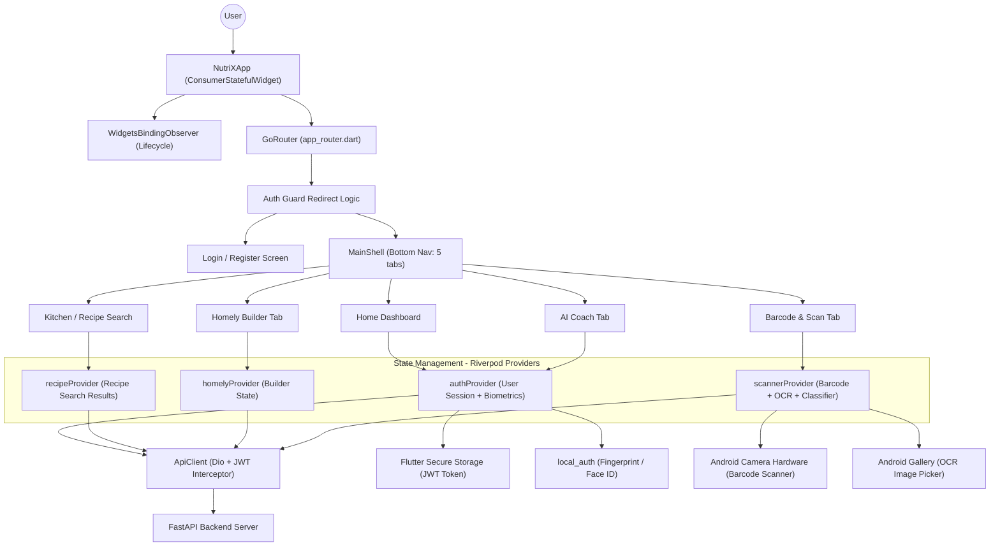
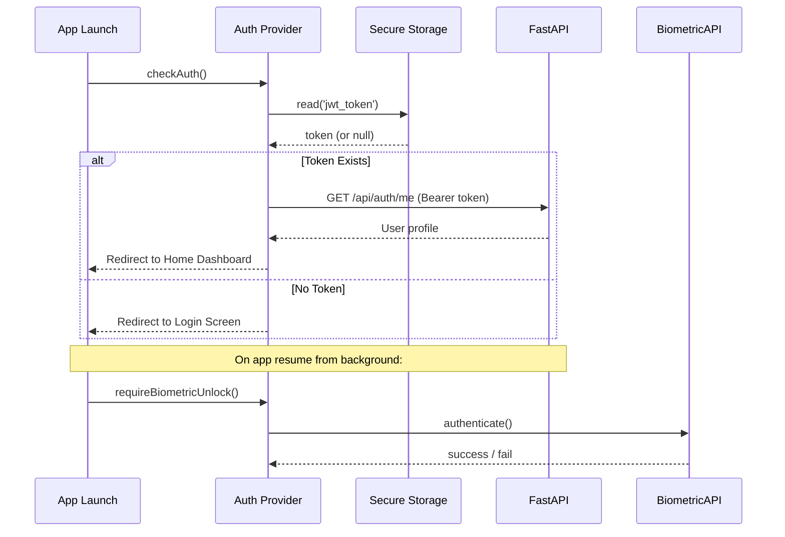
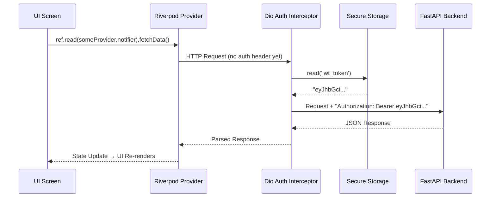
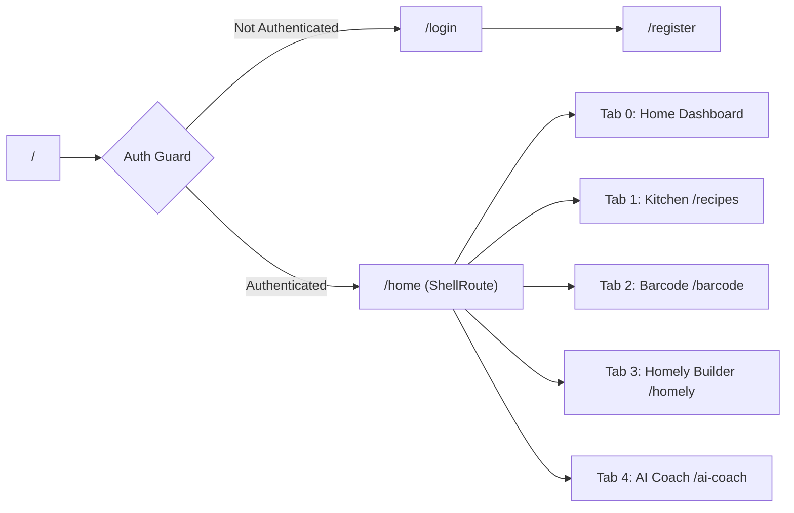
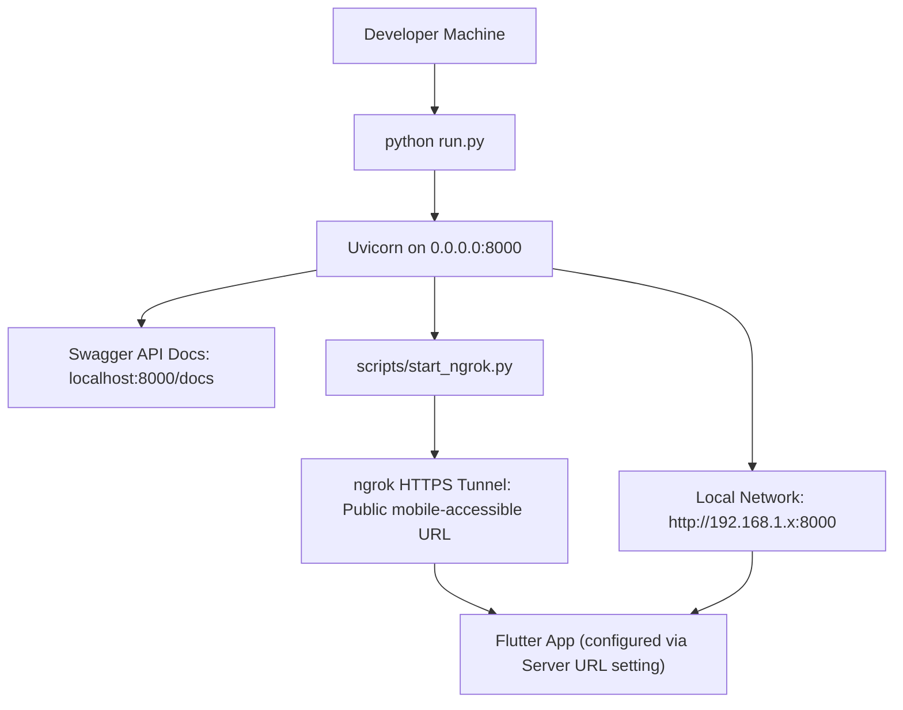

# NutriX — Complete Frontend Architecture

> **Platform:** Android (ARM64) + Web | **Framework:** Flutter SDK (Dart) | **State Management:** Riverpod

---

## 1. System Overview

The NutriX frontend is a **cross-platform Flutter application** that compiles to native Android ARMv8 machine code and WebAssembly for the browser from a **single shared codebase**. It is built with a reactive, unidirectional data-flow architecture and communicates exclusively with the FastAPI backend via REST APIs authenticated with JWT Bearer Tokens.

The UI is dark-mode-aware, animated, and optimized for 60FPS performance on mid-range Android devices.

---

## 2. High-Level Architecture Diagram

---

## 3. Application Screens & Features

### 3.1 Authentication Flow

**Features:**
- **Email/Password Login & Registration** — Standard credential-based auth
- **Google Sign-In** — OAuth2 flow via `google_sign_in` package; ID Token sent to backend for verification
- **JWT Session Persistence** — Token stored in Android Keystore via `flutter_secure_storage`. The app automatically resumes the session on next launch.
- **Biometric Lock** — `WidgetsBindingObserver` detects when the app comes back from the background (`AppLifecycleState.resumed`) and immediately calls `requireBiometricUnlock()` to force fingerprint/face verification before showing any content.
- **Smart Navigation Guard** — GoRouter's `redirect` callback checks auth state and automatically routes users to Login or Home as appropriate.

---

### 3.2 Home Dashboard

**Screen:** `lib/screens/home/home_screen.dart`

An interactive daily overview panel displaying:
- **Macro Progress Rings** — Animated circular progress indicators for Calories, Protein, Carbs, and Fat consumed vs. daily target.
- **Historical Macro Chart** — `fl_chart` bar chart showing the last 7 days of average calorie intake vs. target.
- **Today's Meal Log** — Chronological list of all meals logged today (Breakfast, Lunch, Dinner, Snacks).
- **Quick-Log Shortcuts** — Buttons to jump directly to the barcode scanner or recipe search.
- **Welcome Banner** — Personalized greeting with the user's first name.

---

### 3.3 Kitchen / Recipe Search

**Screen:** `lib/screens/recipes/recipe_search_screen.dart`
**Provider:** `lib/providers/recipe_provider.dart`

A powerful recipe discovery interface with:
- **Ingredients Input** — Comma-separated list of ingredients on hand (e.g., "paneer, tomato, spinach").
- **Filters:**
  - Max Cooking Time (minutes)
  - Results Count (Top 5 / 10 / 15 / 20)
  - Goal Filter (Weight Loss, Muscle Gain, Maintenance)
  - Diet Type (Vegetarian, Vegan, No Filter)
  - Cuisine (Indian, etc.)
  - Exclude Ingredients
- **Results Display** — Ranked recipe cards showing: Recipe Name, Category, Cuisine, Match Score, Health Score (with colour badge: Healthy/Moderate/Unhealthy), full macro breakdown (kcal, protein, carbs, fat per serving).
- **Recipe Detail** — Expandable ingredient list and AI-generated step-by-step cooking instructions fetched live from Gemini.
- **Recommended Recipes Showcase** — A pre-loaded section showing popular recipes based on the user's saved dietary goal.

---

### 3.4 Barcode & Scan Tab

**Screen:** `lib/screens/barcode/barcode_scanner_screen.dart`
**Provider:** `lib/providers/scanner_provider.dart`

Three distinct tools in one screen:

#### A. Barcode Scanner
- **Camera Scan** — Launches `simple_barcode_scanner` (native Android camera) to scan physical product barcodes. An `ignoreNextLifecycleResume` flag is set before launching the camera to prevent the biometric lock from triggering on return.
- **Manual Input** — Text field for typing a barcode directly.
- **Product Display** — Shows product name, brand, nutrition grade, health score, and full macros per 100g.
- **Healthier Alternatives** — Backend returns 3 alternative products with cheaper prices and better health scores.
- **Manual Fallback** — If a barcode is not in the Open Food Facts database, the user can manually enter product details.

#### B. Dietary Rules Classifier
- User enters a comma-separated ingredient list.
- The backend checks each ingredient against the `ingredient_rules` database table.
- Results show: ✅/❌ flags for Vegan, Vegetarian, Jain, Eggetarian, plus specific violation reasons.

#### C. OCR Nutrition Label Scanner
- User picks an image from the gallery (the `ignoreNextLifecycleResume` flag is set before launching the gallery picker).
- Backend processes the image with EasyOCR + regex to extract: calories, protein, carbs, fat, sodium, fibre.
- Results are logged directly to the user's meal diary.

---

### 3.5 Homely Builder Tab

**Screen:** `lib/screens/homely/homely_builder_screen.dart`
**Provider:** `lib/providers/homely_provider.dart`

A live, interactive macro calculator for home-cooked Indian meals:
- **Ingredient Search** — Type any ingredient (e.g., "basmati rice") with fuzzy matching against the master foods database.
- **Amount & Unit Selection** — Select quantity and unit (grams, cups, tbsp, etc.) from predefined lists.
- **Live Macro Calculation** — As ingredients are added, the backend computes and returns the combined macro totals in real time.
- **Save to Library** — Save the custom meal (name, cuisine, region, tags) to the user's personal Homely Meals library.
- **Community Meals Search** — Browse community-submitted homely meals with a search bar.
- **Pending Meals Review** — View meals awaiting community approval.

---

### 3.6 AI Coach Tab

**Screen:** `lib/screens/ai_coach/`
**Provider:** `authProvider` (user context)

A fully conversational AI diet coach powered by **Google Gemini 2.0 Flash**:
- **Chat Interface** — Message bubbles with distinct user and AI styling.
- **Context-Aware Responses** — The backend injects the user's current macro targets, today's remaining budget, dietary restrictions, and fitness goal into every prompt before it reaches Gemini.
- **Personalized Diet Plan Generation** — A separate button generates a complete 1-day structured meal plan narrative based on the user's full biometric profile.
- **Offline Fallback** — If the Gemini API is unavailable, the backend returns a pre-crafted rule-based dietary response.

---

## 4. Network Layer: Dio HTTP Client

**File:** `lib/core/network/api_client.dart`

**Key properties:**
- **Base URL** dynamically configured from `ApiConfigNotifier` (stored in `SharedPreferences`), with a default fallback IP.
- **10-second timeouts** on both connection and data receive.
- **Auth Interceptor** automatically injects the JWT token into every request's headers — no screen ever manually attaches the token.
- **Typed model parsing** — All JSON responses are parsed via `fromJson()` factory constructors into strongly-typed Dart model classes (`User`, `Recipe`, `HomelyMeal`, `MealPlan`).

---

## 5. State Management: Riverpod

All application state is managed via **Riverpod providers**, ensuring:
- **Zero memory leaks** — Providers are scoped to the `ProviderScope` at app root and automatically disposed when no longer needed.
- **Reactive UI** — `ref.watch()` causes the UI to automatically re-render when data changes. No `setState()` spaghetti.
- **Separation of Concerns** — Network logic lives in notifiers, not in widgets.

| Provider | File | State Managed |
|---|---|---|
| `authProvider` | `providers/auth_provider.dart` | User session, auth status, biometric lock, login/logout |
| `recipeProvider` | `providers/recipe_provider.dart` | Recipe search results and loading state |
| `homelyProvider` | `providers/homely_provider.dart` | Builder ingredients, calculated macros, saved meals |
| `barcodeProvider` | `providers/scanner_provider.dart` | Scanned product data, alternatives, manual entry |
| `ocrProvider` | `providers/scanner_provider.dart` | OCR upload state and extracted nutrition data |
| `classificationProvider` | `providers/scanner_provider.dart` | Ingredient classification results |
| `analyticsProvider` | `providers/scanner_provider.dart` | Daily macro totals and historical chart data |
| `apiConfigProvider` | `core/network/api_config.dart` | Server URL configuration (persisted to SharedPreferences) |
| `routerProvider` | `core/router/app_router.dart` | GoRouter instance with auth-aware redirect logic |

---

## 6. Navigation & Routing: GoRouter

**File:** `lib/core/router/app_router.dart`

- **ShellRoute** wraps all authenticated screens with the persistent Bottom Navigation Bar.
- **Auth redirect** checks `authProvider` state on every navigation event.
- **Deep linking** is supported for both Android and Web.

---

## 7. UI & Design System

**Theme File:** `lib/core/theme/app_theme.dart`

| Element | Details |
|---|---|
| Typography | Google Fonts (`Inter`) — weights 400/600/800/900 |
| Color Palette | Dark-mode-aware; primary `AppColors.primary` (green), `AppColors.blueAction`, `AppColors.purpleAction`, `AppColors.calories` (orange) |
| Cards | Rounded radius 16px, subtle border stroke, light shadow |
| Micro-animations | `flutter_animate` for fade-in/slide-in on screen loads |
| Data Charts | `fl_chart` package — Bar charts for 7-day history, line charts for weight trend |
| Nutrition Progress | `percent_indicator` — Circular macro rings on the Home Dashboard |
| Loading States | `shimmer` package — Skeleton loaders while data is fetching |

---

## 8. Security Architecture

| Threat | Mitigation |
|---|---|
| API Unauthorized Access | All state-changing endpoints require a valid JWT Bearer Token |
| Token Theft | JWT stored in Android Keystore via `flutter_secure_storage` (not SharedPreferences) |
| Physical Device Access | App locks itself on every background resume and requires biometric re-auth |
| Camera/Gallery Hijack | `ignoreNextLifecycleResume` flag prevents false biometric lock when user opens the camera or image picker intentionally |
| MITM / Data Intercept | All production traffic over HTTPS; token never logged or printed |

---

## 9. Technology Stack Summary

| Layer | Technology | Purpose |
|---|---|---|
| UI Framework | Flutter 3.x (Dart) | Cross-platform native Android + Web |
| State Management | Riverpod 2.6 | Reactive, type-safe app-wide state |
| Routing | GoRouter 14.8 | Declarative navigation with auth guards |
| HTTP Client | Dio 5.7 | REST API calls with JWT interceptor |
| Secure Storage | flutter_secure_storage 9.2 | Android Keystore JWT token storage |
| Preferences | shared_preferences 2.3 | Server URL and light UI settings |
| Biometrics | local_auth 3.0 | Fingerprint / Face ID authentication |
| Barcode | simple_barcode_scanner 0.6 | Native Android camera barcode scanning |
| Image Picker | image_picker 1.1 | Gallery image selection for OCR |
| Charts | fl_chart 0.70 | Macro progress bars and history charts |
| Progress Rings | percent_indicator 4.2 | Circular macro target rings |
| Animations | flutter_animate 4.5 | Micro-animations and transitions |
| Shimmer | shimmer 3.0 | Skeleton loading placeholders |
| Fonts | google_fonts 6.3 | Inter typeface for premium typography |
| Navigation Icons | cupertino_icons | iOS-style icons on Android |
| Auth | google_sign_in 7.2 | Google OAuth 2.0 login flow |
| Build Target (Android) | arm64-v8a release APK | Optimized for 64-bit Android devices |

---

## 10. Deployment & Access

- The Flutter app stores the backend server URL in `SharedPreferences` via the `ApiConfigNotifier`, allowing the user to switch between local and ngrok URLs from within the app settings.
- For development, the default IP is set in `api_endpoints.dart` as the fallback when no saved URL exists.

---

## 11. Communication Contract: Frontend ↔ Backend Schema

The backend uses **Pydantic V2** to strictly validate all incoming requests and serialize all outgoing responses. The Flutter frontend parses these with Dart `fromJson()` factory constructors:

| Backend Pydantic Schema | Dart Model | Description |
|---|---|---|
| `UserCreate` / `UserLogin` | `User` | Auth credentials and user profile |
| `RecipeRecommendRequest` | — | Ingredient list + filters for recipe search |
| `MealLogCreate` | `MealLog` | Individual meal diary entry |
| `HomelyMealCreate` | `HomelyMeal` | User-saved custom home-cooked meal |
| `DietPlanRequest` | `MealPlan` | Request for AI-generated meal plan |
| `AiCoachRequest` | — | Message + conversation history for Gemini |

