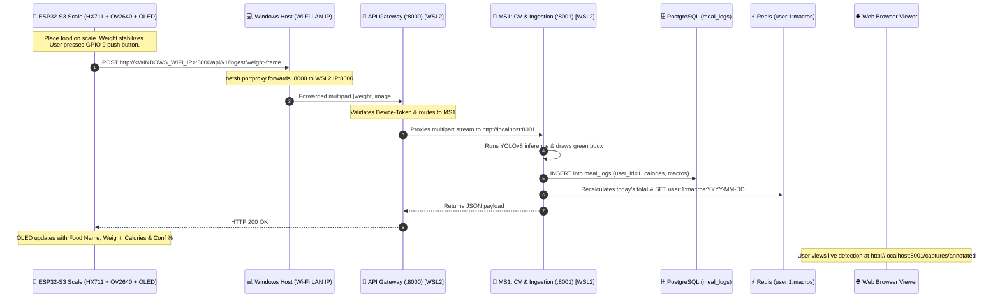

# NutriX Pipeline 1: Hardware Testing Runbook
> **Physical ESP32-S3 Smart Scale $\rightarrow$ Gateway (Port 8000) $\rightarrow$ MS1 Vision (Port 8001) $\rightarrow$ PostgreSQL $\rightarrow$ Redis $\rightarrow$ OLED & Web**

This document is the complete step-by-step developer runbook for testing NutriX with the physical **ESP32-S3 Smart Scale** (HX711 load cell + OV2640 camera + SSD1306 OLED display + push button).

---

## 1. Pipeline Architecture & Data Flow



---

## 2. Pre-Flight Network Setup (One-Time per PC Reboot / Network Switch)

Because WSL2 runs inside an isolated Hyper-V virtual network, external Wi-Fi traffic from the ESP32 to your laptop's Wi-Fi IP must be forwarded to the WSL2 virtual machine.

### Step 2.1: Find Current Laptop Wi-Fi IP
In **Windows PowerShell / Command Prompt**:
```powershell
ipconfig
```
Look for **Wireless LAN adapter Wi-Fi** $\rightarrow$ `IPv4 Address` (e.g., `192.168.29.232` or `172.25.48.1`). Note this as `<HOST_WIFI_IP>`.

### Step 2.2: Find WSL2 Internal IP
In **Windows PowerShell**:
```powershell
wsl -d Ubuntu -- bash -c "ip -4 addr show eth0 | grep -oP '(?<=inet\s)\d+(\.\d+){3}'"
```
*(e.g., `172.25.48.117`)*. Note this as `<WSL_IP>`.

### Step 2.3: Configure Windows Port Forwarding & Firewall
Open **PowerShell as Administrator** on Windows and run:
```powershell
# Forward incoming port 8000 to WSL2
netsh interface portproxy add v4tov4 listenport=8000 listenaddress=0.0.0.0 connectport=8000 connectaddress=<WSL_IP>

# Allow incoming TCP port 8000 through Windows Defender Firewall (run once)
netsh advfirewall firewall add rule name="NutriX Gateway 8000" dir=in action=allow protocol=TCP localport=8000
```
> **Tip:** To verify the portproxy rule is active:
> ```powershell
> netsh interface portproxy show v4tov4
> ```

---

## 3. Environment Preparation

### Step 3.1: Start PostgreSQL & Redis Containers
In your **WSL2 terminal**:
```bash
cd /home/harsh/Nutrix
docker compose up -d postgres redis
```
Verify containers are healthy:
```bash
docker ps
```
*(You should see `nutrix-postgres` on `0.0.0.0:5432` and `nutrix-redis` on `0.0.0.0:6379`)*.

### Step 3.2: Activate Python Virtual Environment
Always activate `.venv` before launching services or scripts:
```bash
cd /home/harsh/Nutrix
source .venv/bin/activate
```

### Step 3.3: Reset Session Data (Clean State)
To avoid negative calorie totals and accumulated test data from previous runs:
```bash
PYTHONPATH=. python scripts/reset_test_session.py
```
This clears today's entries in `meal_logs` for user 1 and sets the Redis key `user:1:macros:YYYY-MM-DD` to `0.0 kcal`.

---

## 4. Starting the Backend Services

Open two separate WSL2 terminal tabs:

### Tab 1: Start MS1 Vision & Ingestion Service (Port 8001)
```bash
cd /home/harsh/Nutrix
source .venv/bin/activate
PYTHONPATH=. uvicorn ms1_cv.main:app --host 0.0.0.0 --port 8001 --reload
```
*Expected Output:*
```text
INFO:     Started server process
INFO:     Waiting for application startup.
INFO:     Application startup complete.
INFO:     Uvicorn running on http://0.0.0.0:8001
```

### Tab 2: Start API Gateway (Port 8000)
```bash
cd /home/harsh/Nutrix
source .venv/bin/activate
PYTHONPATH=. uvicorn gateway.main:app --host 0.0.0.0 --port 8000 --reload
```
*Expected Output:*
```text
Initializing API Gateway...
MS1 CV URL: http://localhost:8001
INFO:     Uvicorn running on http://0.0.0.0:8000
INFO:     Application startup complete.
```

---

## 5. ESP32-S3 Firmware Configuration & Flashing

1. Open your ESP32-S3 Arduino sketch in Arduino IDE.
2. In the configuration section, verify your network settings:
   ```cpp
   const char *ssid        = "YOUR_WIFI_SSID";
   const char *password    = "YOUR_WIFI_PASSWORD";
   const char *SERVER_HOST = "<HOST_WIFI_IP>"; // Laptop Wi-Fi IP from Step 2.1 (e.g. 192.168.29.232)
   const uint16_t SERVER_PORT = 8000;          // Gateway port
   const char *DEVICE_TOKEN   = "NutriX_ESP32_SECURE_TOKEN";
   ```
3. Connect the ESP32-S3 via USB-C, select the board and port, and click **Upload**.
4. Open the **Serial Monitor** (`115200` baud).
5. The scale's SSD1306 OLED display will show:
   ```text
   +--------------------+
   |   NUTRIX SCALE     |
   |   SYSTEM READY     |
   | Press button GPIO9 |
   +--------------------+
   ```

---

## 6. Triggering a Live Hardware Capture

1. **Tare/Zero:** Ensure the scale tray is empty or tared.
2. **Place food item:** Place an ingredient (e.g., Apple, Bell Pepper, Bread) on the scale platform. Wait 1–2 seconds for the HX711 weight reading to stabilize.
3. **Capture:** Press the physical button connected to **GPIO 9**.
4. **Observe the Results:**
   - **ESP32 Serial Monitor:** Prints `HTTP 200 OK` and response body.
   - **ESP32 OLED Display:** Updates with:
     ```text
     +--------------------+
     | Bell Pepper        |
     | Weight:   38.3 g   |
     | Energy:   38.3 kcal|
     | Conf:     78.4%    |
     +--------------------+
     ```
   - **Gateway Logs (Tab 2):** Shows `POST /api/v1/ingest/weight-frame` 200 OK.
   - **MS1 Logs (Tab 1):** Shows:
     ```text
     [CV Engine] Processing event: stable weight = 38.3g, delta = 38.30g
     [Database] Logged meal #1: Bell Pepper (38.3 kcal) for user 1
     [Redis] Synced user:1:macros:2026-09-17 -> 38.3 kcal total today
     ```

---

## 7. Result Inspection & Verification Tools

### A. Live Visual Capture Viewer (Web Browser)
Open your browser to:
- **Annotated image with YOLO bounding box & banner:**  
  [http://localhost:8001/captures/annotated](http://localhost:8001/captures/annotated)
- **Raw camera JPEG:**  
  [http://localhost:8001/captures/latest](http://localhost:8001/captures/latest)

### B. PostgreSQL Meal Logs Viewer
In a WSL2 terminal:
```bash
PYTHONPATH=. python scripts/show_db_logs.py
```
Shows the latest logged meals, weights, and calories from the database.

### C. Redis Live Daily Cache Viewer
In a WSL2 terminal:
```bash
PYTHONPATH=. python scripts/show_redis_cache.py
```
Shows current daily totals (`calories`, `protein_g`, `carbs_g`, `fat_g`, `meals_count`, `latest_item`).

---

## 8. Troubleshooting & Common Hardware Issues

| Symptom / Error | Root Cause | Fix |
|---|---|---|
| `ERROR: Could not connect to API Gateway` on ESP32 Serial Monitor | WSL2 IP changed upon PC restart, or portproxy rule is missing. | Re-run Step 2: check WSL2 IP and update `netsh interface portproxy add v4tov4 ... connectaddress=<NEW_WSL_IP>` |
| ESP32 OLED shows `HTTP 401 / Unauthorized` | Device token mismatch. | Confirm `DEVICE_TOKEN` in ESP32 sketch matches `.env` (`NutriX_ESP32_SECURE_TOKEN`). |
| Redis calories show negative or huge numbers | Leftover test data with uncalibrated negative load cell weights. | Run `PYTHONPATH=. python scripts/reset_test_session.py` to reset today's stats to 0. |
| YOLO detects `Unknown` or low confidence | Insufficient lighting or camera angle. | Ensure scale camera has direct line of sight; verify annotated frame at `http://localhost:8001/captures/annotated`. |
| Database connection refused on startup | Docker containers not running. | Run `docker compose up -d postgres redis`. |

---

## 9. Clean Shutdown Sequence

When finished testing:
1. **Stop microservices:** Press `Ctrl + C` in Terminal 1 (MS1) and Terminal 2 (Gateway).
2. **Stop Docker containers:**
   ```bash
   docker compose down
   ```
   *(Omitting `-v` preserves PostgreSQL data).*
3. **Clean up Windows port forwarding (optional):**
   ```powershell
   netsh interface portproxy delete v4tov4 listenport=8000 listenaddress=0.0.0.0
   ```
