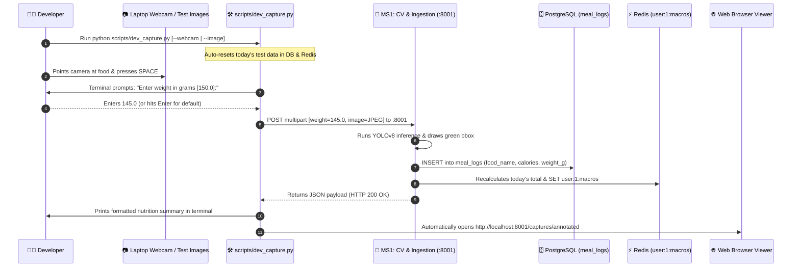

# NutriX Pipeline 2: Software-Only Testing Runbook
> **Webcam / Test Images $\rightarrow$ `scripts/dev_capture.py` $\rightarrow$ MS1 Vision (Port 8001) $\rightarrow$ PostgreSQL $\rightarrow$ Redis $\rightarrow$ Web Viewer**

This document is the complete step-by-step developer runbook for testing NutriX **entirely in software** without requiring the physical ESP32-S3 scale, load cells, or Windows portproxy configuration.

---

## 1. Why Pipeline 2?

| Feature | Pipeline 1 (Hardware) | Pipeline 2 (Software Mode) |
|---|---|---|
| **Hardware Required** | ESP32-S3, HX711, Camera, OLED | **None** (Laptop webcam or sample images) |
| **Gateway Required** | Yes (Device-Token auth) | **No** (Direct to MS1 at `:8001`) |
| **Port Forwarding / IP** | Requires `netsh portproxy` & Wi-Fi IP | **None** (pure `localhost:8001`) |
| **Speed of Iteration** | 1–2 minutes per test | **Seconds** (one keypress or one CLI command) |
| **Ideal For** | Final system integration & demos | **Daily backend, CV & mobile app development** |

---

## 2. Pipeline Architecture & Data Flow



---

## 3. Environment Preparation

### Step 3.1: Start PostgreSQL & Redis Containers
In your **WSL2 terminal**:
```bash
cd /home/harsh/Nutrix
docker compose up -d postgres redis
```
Verify containers are running:
```bash
docker ps
```

### Step 3.2: Activate Python Virtual Environment
```bash
cd /home/harsh/Nutrix
source .venv/bin/activate
```

---

## 4. Starting the MS1 Vision Service

In a WSL2 terminal:
```bash
cd /home/harsh/Nutrix
source .venv/bin/activate
PYTHONPATH=. uvicorn ms1_cv.main:app --host 0.0.0.0 --port 8001 --reload
```
*Expected Output:*
```text
INFO:     Started server process
INFO:     Waiting for application startup.
INFO:     Application startup complete.
INFO:     Uvicorn running on http://0.0.0.0:8001
```
> **Note:** Only MS1 needs to run for Pipeline 2. You do **not** need to start the Gateway unless you are explicitly testing Gateway authentication.

---

## 5. Running the Dev Capture Tool (`scripts/dev_capture.py`)

The tool supports three flexible testing modes:

---

### Mode A: Laptop Webcam Mode (Interactive Live Testing)

This opens an OpenCV camera window displaying your laptop's live camera feed.

#### Important Note on WSL2 vs Windows:
- WSL2 does not have access to laptop webcams by default without USB pass-through (`usbipd`).
- **Best Practice for Webcam:** Run the capture script from **Windows Command Prompt / PowerShell** (in `C:\MAIN\Project\CalCount`), which accesses your camera natively and connects to MS1 on `http://localhost:8001`:

```powershell
# In Windows PowerShell / Command Prompt:
cd C:\MAIN\Project\CalCount
python scripts\dev_capture.py --webcam
```

*(Alternatively, if running inside WSL with an attached USB camera or virtual camera: `PYTHONPATH=. python scripts/dev_capture.py --webcam`)*

#### How It Works:
1. The script resets today's test logs in DB and Redis so you start with `0.0 kcal`.
2. A window titled **"NutriX Dev Capture"** appears showing your live webcam.
3. Hold up a food item (e.g., Apple, Banana, Bread, Tomato).
4. Press **`SPACE`** to freeze the frame and capture.
5. In your terminal, you will see:
   ```text
   >>> Enter food weight in grams [default: 150.0g]: 
   ```
   Type the weight (e.g. `125`) and press Enter, or simply press Enter to accept `150.0g`.
6. The script sends the multipart request to MS1, prints the result in terminal, and opens the annotated detection in your browser at `http://localhost:8001/captures/annotated`.
7. You can continue capturing more foods, or press **`Q`** to exit.

---

### Mode B: Single Image Mode (Fastest for Debugging)

If you have a sample JPEG/PNG photo of food and want to test YOLO detection and database logging instantly:

In WSL2 or Windows:
```bash
# In WSL2:
PYTHONPATH=. python scripts/dev_capture.py --image inference_outputs/esp32.jpg --weight 180.0
```

*Expected Output:*
```text
=================================================================
         NUTRIX INGEST RESULT (HTTP 200 OK)
=================================================================
  • Status          : identified
  • Food Identified : Apple
  • Confidence      : 84.5%
  • Weight          : 180.0 g
  • Calories        : 93.6 kcal
  • Session ID      : a3d89f21-789a-4c21-b391-7681fbb41290
  • Latency         : 84.2 ms
=================================================================
  [Viewer] Opening http://localhost:8001/captures/annotated in browser...
```

---

### Mode C: Batch Folder Mode (Testing Multiple Images)

To run automated inference across an entire folder of test images:

```bash
PYTHONPATH=. python scripts/dev_capture.py --images inference_outputs/ --weight 150.0
```
This iterates through all images in the folder, sends them to MS1 sequentially, and records each into PostgreSQL and Redis.

---

## 6. Advanced Options for `dev_capture.py`

| Flag | Default | Description |
|---|---|---|
| `--webcam` | `False` | Launch interactive laptop webcam mode |
| `--image <file>` | `None` | Path to a single image file to ingest |
| `--images <dir>` | `None` | Directory of images to batch ingest |
| `--weight <grams>` | `None` | Preset food weight (skips terminal prompt if set) |
| `--default-weight <grams>` | `150.0` | Default weight value when prompted |
| `--prompt-weight` | `False` | Force interactive weight prompt in terminal |
| `--url <endpoint>` | `http://localhost:8001/...` | Target endpoint URL (can be pointed to Gateway) |
| `--user-id <id>` | `1` | Value for `x-user-id` header |
| `--token <token>` | `None` | `device-token` header (required if testing via Gateway) |
| `--no-browser` | `False` | Do not automatically open the browser viewer |
| `--reset` | `True` | Auto-reset today's meal logs & Redis cache at start |
| `--no-reset` | `False` | Preserve existing meal logs & Redis cache |

### Testing Through the API Gateway (Optional)
If you want to test Pipeline 2 through the Gateway (to test authentication and routing):
1. Start Gateway in another tab: `PYTHONPATH=. uvicorn gateway.main:app --host 0.0.0.0 --port 8000 --reload`
2. Run `dev_capture.py` pointing to port 8000:
   ```bash
   PYTHONPATH=. python scripts/dev_capture.py --image inference_outputs/esp32.jpg --weight 150 --url http://localhost:8000/api/v1/ingest/weight-frame --token NutriX_ESP32_SECURE_TOKEN
   ```
2. Run `dev_capture.py` pointing to port 8000:
   ```bash
   PYTHONPATH=. python scripts/dev_capture.py --image inference_outputs/banana-trial.jpg --weight 150 --url http://localhost:8000/api/v1/ingest/weight-frame --token NutriX_ESP32_SECURE_TOKEN
   ```

---

## 7. Result Inspection & Verification

After any capture:

### 1. Visual Inspection in Web Browser
- **Live Annotated Bounding Box:** [http://localhost:8001/captures/annotated](http://localhost:8001/captures/annotated)
- **Raw Ingested Frame:** [http://localhost:8001/captures/latest](http://localhost:8001/captures/latest)

### 2. Inspect PostgreSQL Meal Logs
In WSL2:
```bash
PYTHONPATH=. python scripts/show_db_logs.py
```

### 3. Inspect Redis Live Macro Cache
In WSL2:
```bash
PYTHONPATH=. python scripts/show_redis_cache.py
```

### 4. Manually Reset Session Data
Whenever you want to start completely fresh:
```bash
PYTHONPATH=. python scripts/reset_test_session.py
```

---

## 8. Summary Checklist for Daily Development

```bash
# 1. Start containers
docker compose up -d postgres redis

# 2. Start MS1 (Terminal 1)
source .venv/bin/activate
PYTHONPATH=. uvicorn ms1_cv.main:app --host 0.0.0.0 --port 8001 --reload

# 3. Ingest frame (Terminal 2 or Windows Command Prompt)
python scripts/dev_capture.py --webcam
# OR
python scripts/dev_capture.py --image dataset/pending/sample.jpg --weight 150

# 4. Check results
python scripts/show_db_logs.py
python scripts/show_redis_cache.py
```
