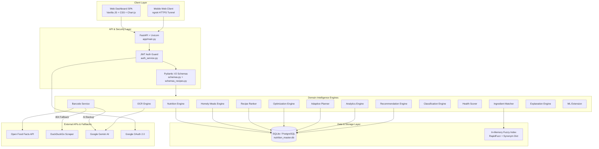
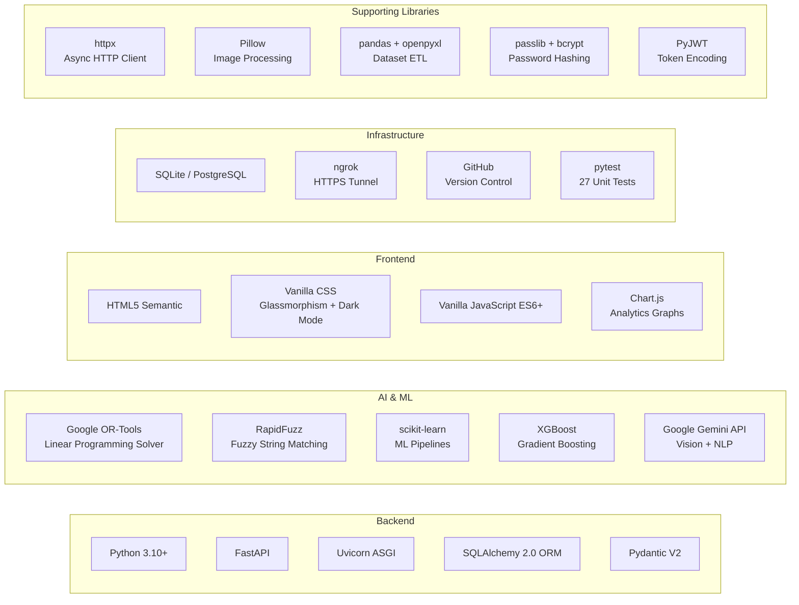
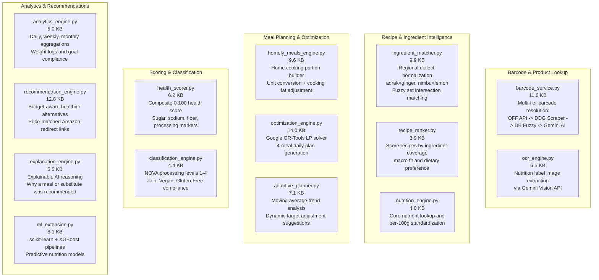
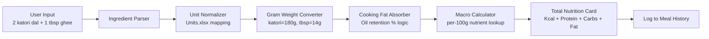
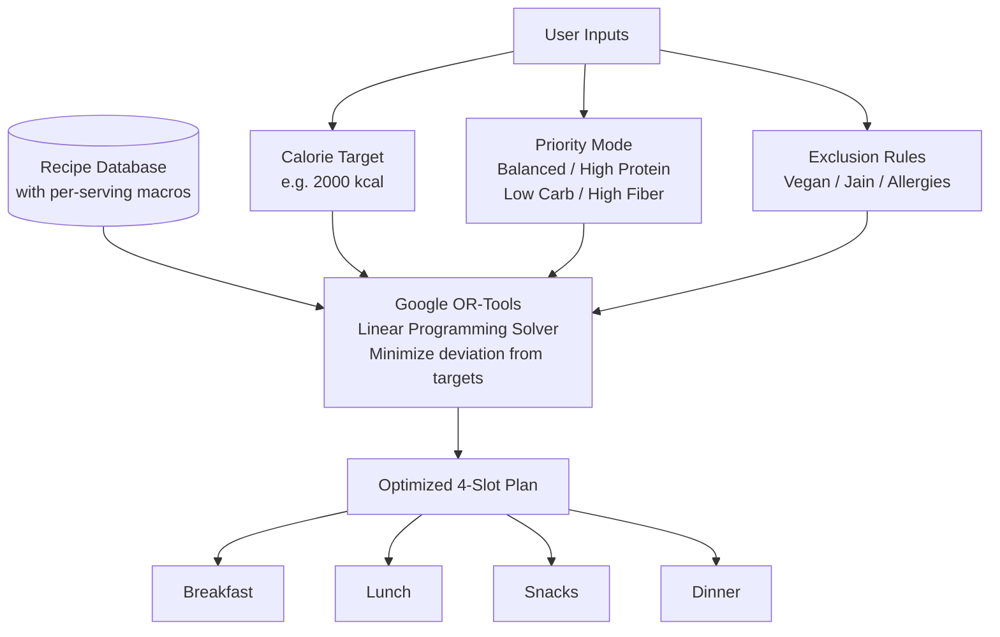
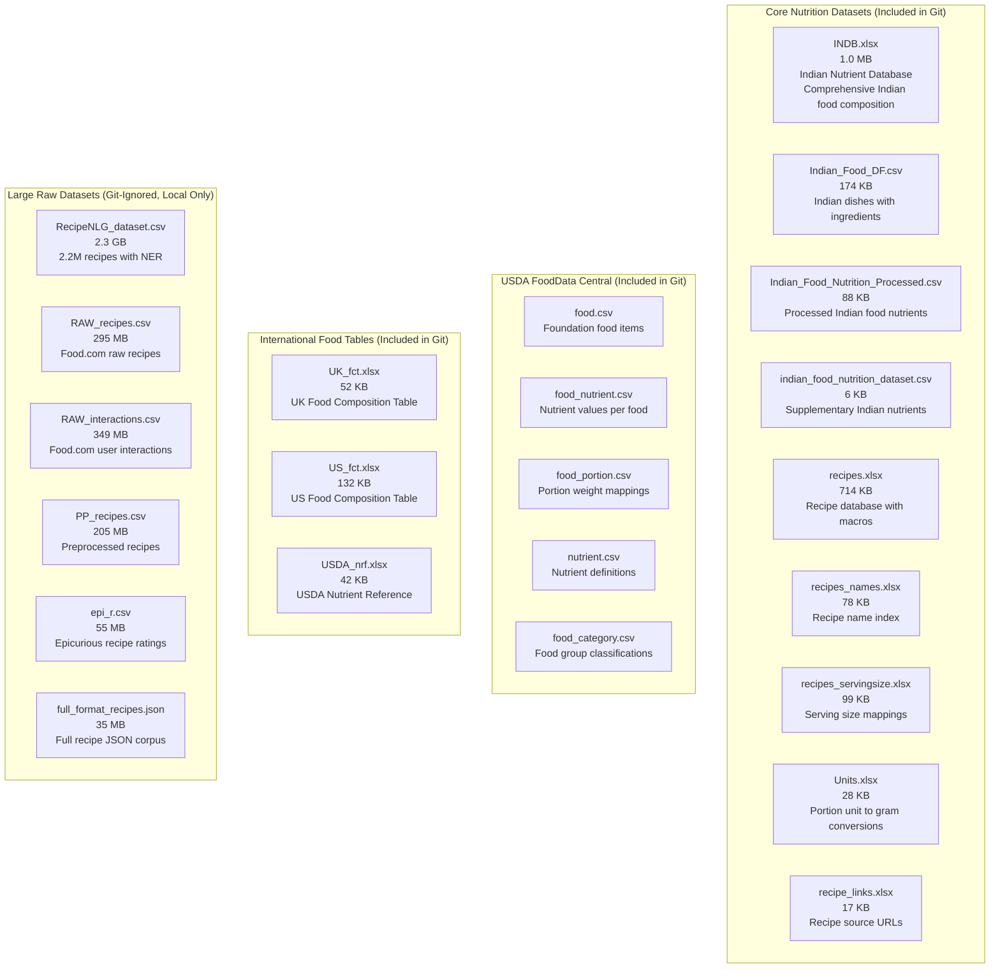
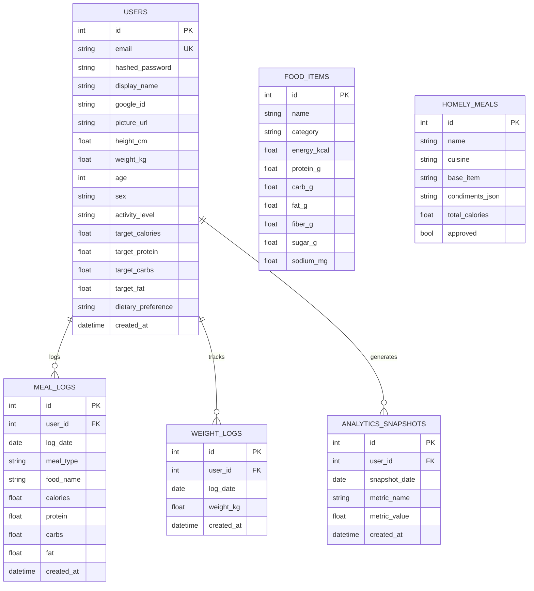
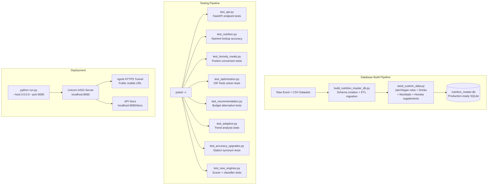

# NutriX — Complete Project Architecture

---

## 1. High-Level System Architecture



---

## 2. Tech Stack



---

## 3. All 14 Domain Engine Modules



---

## 4. Barcode Multi-Tier Fallback Sequence

```mermaid
sequenceDiagram
    autonumber
    actor User
    participant SVC as Barcode Service
    participant OFF as Open Food Facts API
    participant DDG as DuckDuckGo Scraper
    participant DB as Master Database
    participant AI as Gemini AI API

    User->>SVC: Input barcode 8901719117972
    SVC->>OFF: GET product by barcode
    alt Product found
        OFF-->>SVC: 200 OK with nutrients
    else 404 Not Found
        SVC->>DDG: Scrape product title from search
        DDG-->>SVC: Extracted product name
        SVC->>DB: Fuzzy match name in local DB
        alt DB match found
            DB-->>SVC: Standardized nutrients
        else No DB match
            SVC->>AI: Estimate nutrients via Gemini
            AI-->>SVC: AI-estimated nutrients
        end
    end
    SVC->>SVC: Compute health score 0-100
    SVC->>SVC: Generate budget alternatives
    SVC-->>User: Product card with alternatives
```

---

## 5. Homely Meal Builder Pipeline



---

## 6. Diet Plan Optimization Solver



---

## 7. Datasets & Knowledge Base Inventory



---

## 8. Database Schema (ER Diagram)



---

## 9. Build, Test & Deploy Pipeline



---

## 10. Complete File Tree

```mermaid
graph TD
    ROOT["NutriX AI Diet Planner"] --> APP["app/"]
    ROOT --> DATASET["Dataset/"]
    ROOT --> SCRIPTS["scripts/"]
    ROOT --> TESTS["tests/"]
    ROOT --> CONF["Config Files"]

    APP --> A1["__init__.py"]
    APP --> A2["main.py (80 KB)<br/>All API routes + SPA template"]
    APP --> A3["models.py (23 KB)<br/>SQLAlchemy ORM models"]
    APP --> A4["db.py<br/>DB connection + fallback logic"]
    APP --> A5["schemas.py<br/>Pydantic request/response"]
    APP --> A6["schemas_recipes.py<br/>Recipe-specific schemas"]
    APP --> SVC["services/"]

    SVC --> S1["auth_service.py"]
    SVC --> S2["barcode_service.py"]
    SVC --> S3["nutrition_engine.py"]
    SVC --> S4["homely_meals_engine.py"]
    SVC --> S5["ingredient_matcher.py"]
    SVC --> S6["recipe_ranker.py"]
    SVC --> S7["optimization_engine.py"]
    SVC --> S8["adaptive_planner.py"]
    SVC --> S9["analytics_engine.py"]
    SVC --> S10["recommendation_engine.py"]
    SVC --> S11["classification_engine.py"]
    SVC --> S12["health_scorer.py"]
    SVC --> S13["ocr_engine.py"]
    SVC --> S14["explanation_engine.py"]
    SVC --> S15["ml_extension.py"]

    SCRIPTS --> SC1["build_nutrition_master_db.py"]
    SCRIPTS --> SC2["seed_custom_data.py"]
    SCRIPTS --> SC3["start_ngrok.py"]
    SCRIPTS --> SC4["migrate_models.py"]
    SCRIPTS --> SC5["analyze_mapping.py"]

    CONF --> C1[".env"]
    CONF --> C2[".gitignore"]
    CONF --> C3["requirements.txt"]
    CONF --> C4["run.py"]
    CONF --> C5["README.md"]
```


